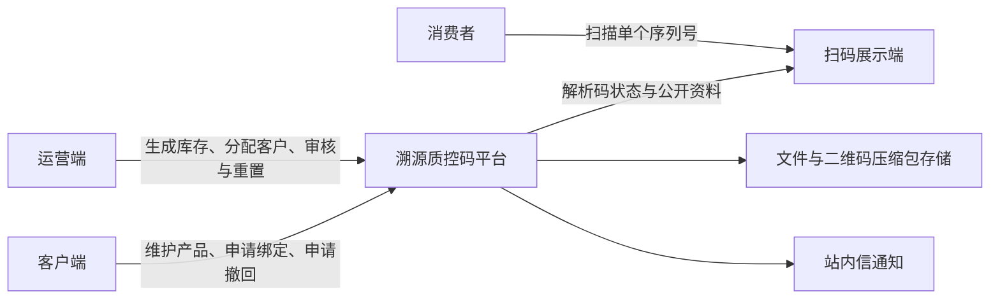
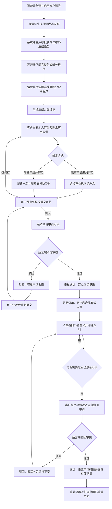
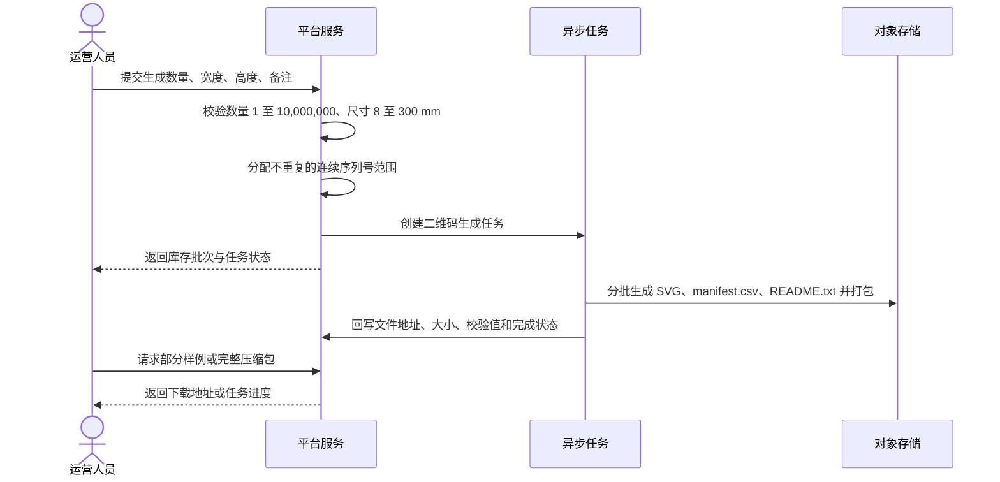
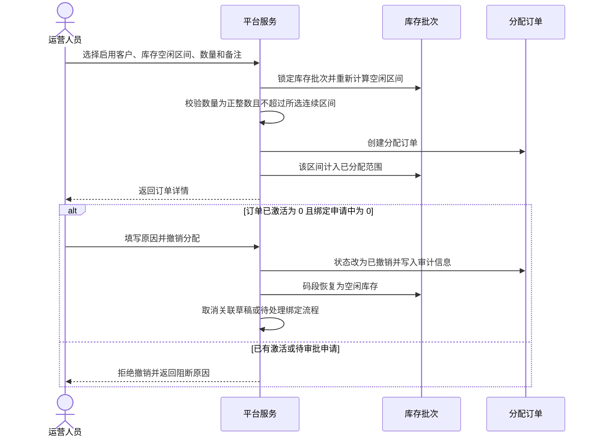
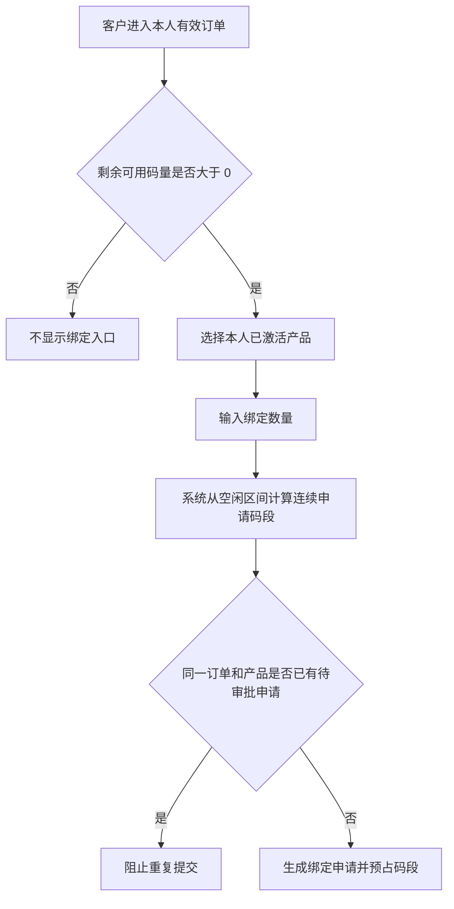
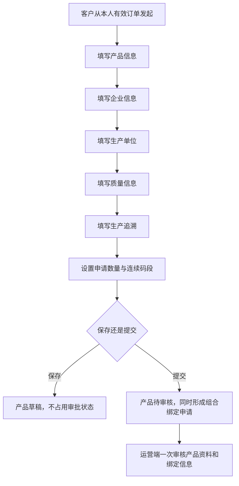
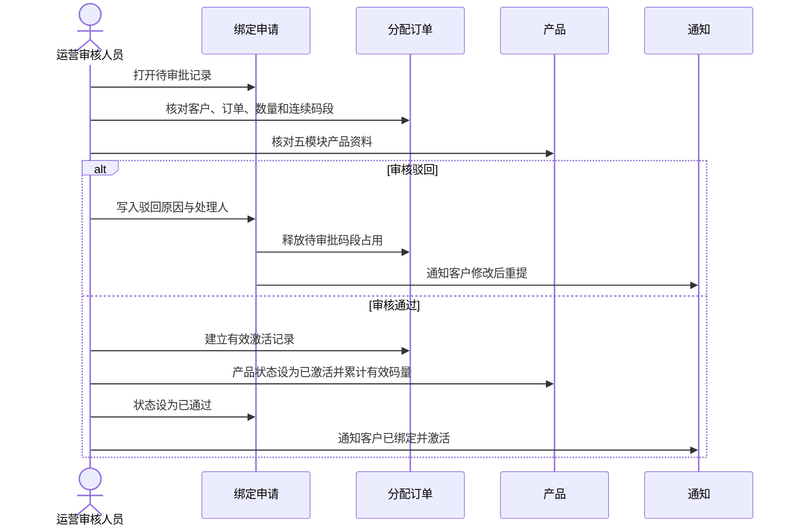
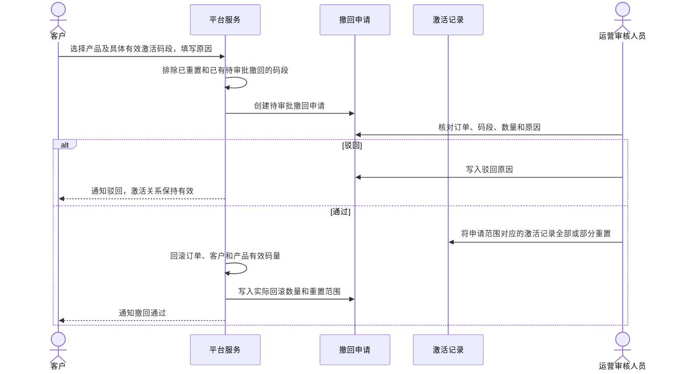
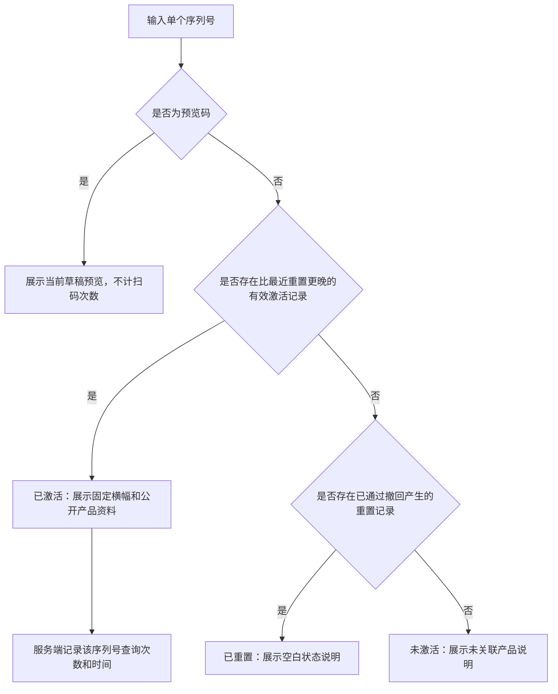

# 业务流程图

## 1. 系统上下文

## 2. 全链路主流程

## 3. 码段生成与下载流程

正式系统中，大批量任务不得在单次 HTTP 请求或浏览器内同步生成。

## 4. 码段分配与撤销分配

撤销分配针对的是“客户码段归属填错”；产品撤回针对的是“已经绑定产品的码需要重置”。二者不得混用。

## 5. 客户绑定流程

### 5.1 已有产品追加绑定

### 5.2 新建产品并绑定

## 6. 绑定审核与激活

运营端还可以从订单详情选择该客户名下的已激活产品直接绑定。直接绑定不产生待审批申请，但必须执行相同的码段可用性校验并建立激活记录。

## 7. 产品撤回流程

## 8. 扫码状态解析流程

新激活时间晚于旧重置时间时，码可以重新进入已激活状态。

