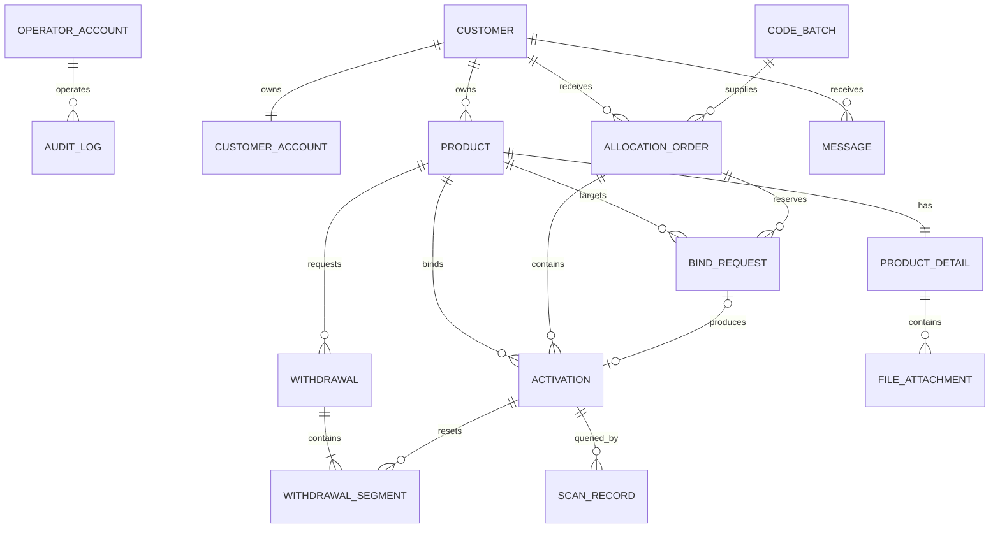

# 数据字典

## 1. 建模原则

- 正式数据库使用服务端生成的稳定主键；业务编号另设唯一字段。
- 所有业务时间使用带时区时间戳存储，接口按 ISO 8601 返回，界面按 `Asia/Shanghai` 展示。
- 码段起止序号必须同时保存可比较的数值部分和原始字符串，避免仅靠字符串切割处理范围。
- 当前原型把激活记录嵌在订单中；正式数据库建议拆成独立表。
- `active_amount`、`pending_amount` 和 `available_amount` 都是可重算数据，不应成为唯一事实来源。

## 2. 实体关系

## 3. 通用字段约定

| 字段 | 类型 | 说明 |
| --- | --- | --- |
| `id` | bigint/uuid | 数据库主键 |
| `created_at` | timestamptz | 创建时间 |
| `created_by` | bigint/uuid, nullable | 创建账号 |
| `updated_at` | timestamptz | 最近更新时间 |
| `updated_by` | bigint/uuid, nullable | 最近更新账号 |
| `version` | integer | 乐观锁版本号，关键业务表必须提供 |
| `deleted_at` | timestamptz, nullable | 仅适用于允许软删除的配置或附件数据；业务流水不物理删除 |

## 4. 运营账号 `operator_account`

| 字段 | 类型 | 必填 | 说明 |
| --- | --- | --- | --- |
| `id` | bigint/uuid | 是 | 主键 |
| `name` | varchar(100) | 是 | 姓名 |
| `account` | varchar(100) | 是 | 登录账号，全局唯一 |
| `password_hash` | varchar(255) | 是 | 密码哈希，禁止存明文 |
| `status` | varchar(20) | 是 | `启用`、`禁用` |
| `last_login_at` | timestamptz | 否 | 最近登录时间 |
| `role_id` | bigint/uuid | 否 | 当前原型未细分角色，正式 RBAC 可使用 |

## 5. 客户与客户账号

### 5.1 客户 `customer`

| 字段 | 类型 | 必填 | 说明 |
| --- | --- | --- | --- |
| `id` | bigint/uuid | 是 | 客户主键，也是所有客户数据隔离键 |
| `name` | varchar(200) | 是 | 客户名称 |
| `phone` | varchar(50) | 是 | 联系电话 |
| `status` | varchar(20) | 是 | `启用`、`禁用` |
| `license_file_id` | bigint/uuid | 是 | 营业执照附件 |
| `legal_id_file_id` | bigint/uuid | 是 | 法人身份证附件 |

### 5.2 客户账号 `customer_account`

| 字段 | 类型 | 必填 | 说明 |
| --- | --- | --- | --- |
| `id` | bigint/uuid | 是 | 主键 |
| `customer_id` | bigint/uuid | 是 | 所属客户，当前业务为一个客户一个主账号 |
| `account` | varchar(100) | 是 | 登录账号，全局唯一 |
| `password_hash` | varchar(255) | 是 | 密码哈希 |
| `status` | varchar(20) | 是 | `启用`、`禁用`；可与客户状态合并判断 |
| `last_login_at` | timestamptz | 否 | 最近登录时间 |

## 6. 库存码段批次 `code_batch`

| 字段 | 类型 | 必填 | 说明 |
| --- | --- | --- | --- |
| `id` | bigint/uuid | 是 | 主键 |
| `batch_no` | varchar(50) | 是 | 业务编号，示例 `BATCH-202608-001`，唯一 |
| `serial_prefix` | varchar(20) | 是 | 序列号前缀，当前默认 `QR` |
| `start_number` | bigint | 是 | 起始数字 |
| `end_number` | bigint | 是 | 结束数字 |
| `start_serial` | varchar(50) | 是 | 完整起始序列号 |
| `end_serial` | varchar(50) | 是 | 完整结束序列号 |
| `total_amount` | integer | 是 | `end_number - start_number + 1`，最大 10,000,000 |
| `width_mm` | decimal(8,2) | 是 | 二维码宽度，8–300 |
| `height_mm` | decimal(8,2) | 是 | 二维码高度，8–300 |
| `style` | varchar(50) | 是 | 当前固定为“二维码核心区块” |
| `note` | varchar(500) | 否 | 备注 |
| `generation_status` | varchar(30) | 是 | 建议：`待生成`、`生成中`、`已完成`、`生成失败` |
| `package_file_id` | bigint/uuid | 否 | 完整压缩包附件 |

派生字段：

- `allocated_amount`：有效分配订单区间并集数量。
- `available_amount`：库存总量减有效分配数量。
- `allocation_status`：`未分配`、`部分分配`、`已分配`。

## 7. 分配订单 `allocation_order`

| 字段 | 类型 | 必填 | 说明 |
| --- | --- | --- | --- |
| `id` | bigint/uuid | 是 | 主键 |
| `order_no` | varchar(50) | 是 | 业务编号；当前新记录示例 `ALLOC-202608-001`，历史记录可能为 `ORD-*` |
| `source_batch_id` | bigint/uuid | 是 | 来源库存批次 |
| `customer_id` | bigint/uuid | 是 | 获得该码段的客户 |
| `start_number` | bigint | 是 | 分配范围起始数字 |
| `end_number` | bigint | 是 | 分配范围结束数字 |
| `start_serial` | varchar(50) | 是 | 完整起始序列号 |
| `end_serial` | varchar(50) | 是 | 完整结束序列号 |
| `total_amount` | integer | 是 | 订单码量 |
| `allocation_status` | varchar(20) | 是 | `已分配`、`已撤销` |
| `allocated_at` | timestamptz | 是 | 分配时间 |
| `allocated_by` | bigint/uuid | 是 | 分配操作人 |
| `note` | varchar(500) | 否 | 订单备注 |
| `recalled_at` | timestamptz | 否 | 撤销分配时间 |
| `recalled_by` | bigint/uuid | 否 | 撤销操作人 |
| `recall_reason` | varchar(1000) | 否 | 撤销原因 |

派生字段：`active_amount`、`pending_amount`、`available_amount`。

## 8. 产品 `product`

| 字段 | 类型 | 必填 | 说明 |
| --- | --- | --- | --- |
| `id` | bigint/uuid | 是 | 主键 |
| `customer_id` | bigint/uuid | 是 | 所属客户 |
| `name` | varchar(200) | 是 | 产品名称 |
| `category` | varchar(50) | 否 | 产品大类 |
| `batch` | varchar(100) | 是 | 产品批次；同名产品不同批次应视为不同业务版本 |
| `status` | varchar(20) | 是 | `草稿`、`待审核`、`已激活`、`已驳回` |
| `submitted_at` | timestamptz | 否 | 最近提交时间 |
| `decided_at` | timestamptz | 否 | 最近审核时间 |
| `decided_by` | bigint/uuid | 否 | 最近审核人 |
| `rejection_reason` | varchar(1000) | 否 | 最近驳回原因 |
| `active_amount` | integer | 否 | 缓存值，必须可由激活记录重算 |
| `application_type` | varchar(50) | 否 | 当前组合流程使用“新建产品并绑定” |
| `requested_order_id` | bigint/uuid | 否 | 组合申请关联订单 |
| `requested_start_number` | bigint | 否 | 组合申请码段起点 |
| `requested_end_number` | bigint | 否 | 组合申请码段终点 |
| `requested_amount` | integer | 否 | 组合申请数量 |

建议对 `(customer_id, name, batch)` 建立业务查询索引，但是否唯一需结合客户是否允许同批次多版本确认。

## 9. 产品资料 `product_detail`

建议以结构化列加 JSON 扩展字段实现：标准字段用于查询和校验，自定义字段存储在 JSON 或独立扩展表中。

### 9.1 产品信息模块

| 字段 | 类型 | 必填 | 扫码展示 | 说明 |
| --- | --- | --- | --- | --- |
| `category` | varchar(50) | 否 | 否 | 产品大类 |
| `subcategory` | varchar(100) | 否 | 否 | 产品子类 |
| `product_name` | varchar(200) | 是 | 是 | 产品名称 |
| `brand` | varchar(200) | 是 | 是 | 产品品牌，可关联 1 张品牌图 |
| `trademark` | varchar(200) | 否 | 是 | 产品商标，可关联 1 张图 |
| `product_images` | file[] | 否 | 是 | 产品图片，最多 10 张 |
| `intro` | text | 否 | 是 | 产品介绍 |
| `specification` | varchar(200) | 否 | 是 | 产品规格 |
| `origin` | varchar(300) | 否 | 是 | 产品产地 |
| `batch` | varchar(100) | 是 | 是 | 产品批次 |
| `production_date` | date | 否 | 是 | 产品生产日期 |
| `shelf_life` | varchar(100) | 否 | 是 | 产品保质期 |
| `storage` | varchar(300) | 否 | 是 | 储存条件 |
| `standard` | varchar(300) | 否 | 是 | 执行标准 |

### 9.2 企业信息模块

| 字段 | 类型 | 必填 | 说明 |
| --- | --- | --- | --- |
| `company_name` | varchar(200) | 是 | 公司名称 |
| `company_address` | varchar(500) | 否 | 公司地址 |
| `company_intro` | text | 否 | 公司介绍 |
| `company_phone` | varchar(50) | 否 | 公司电话 |
| `business_license` | file | 否 | 营业执照，图片或 PDF，最多 1 个 |
| `qualification_proof` | file[] | 否 | 生产许可、体系认证、荣誉证书等，最多 10 个 |
| `production_environment` | image[] | 否 | 生产环境图片，最多 10 张 |

### 9.3 生产单位模块

| 字段 | 类型 | 必填 | 说明 |
| --- | --- | --- | --- |
| `production_unit` | varchar(200) | 是 | 生产单位 |
| `production_address` | varchar(500) | 否 | 生产地址 |
| `production_site_environment` | image[] | 否 | 生产环境，最多 10 张 |
| `qualification_documents` | file[] | 否 | 资质证件，图片或 PDF，最多 10 个 |
| `process` | text + image[] | 否 | 独特工艺流程 |
| `equipment` | text + image[] | 否 | 关键生产设备 |
| `production_license` | file[] | 否 | 生产许可证书及认证证书 |

### 9.4 质量信息模块

| 字段 | 类型 | 必填 | 说明 |
| --- | --- | --- | --- |
| `product_honor_certificate` | file[] | 否 | 产品荣誉证 |
| `product_certification_certificate` | file[] | 否 | 产品认证证书 |
| `on_site_verification_certificate` | file[] | 否 | 实地验证证书 |
| `product_inspection_report` | text + file | 否 | 同批次六个月以内检测报告；标准文件最多 1 个 |

### 9.5 生产追溯模块

| 字段 | 类型 | 必填 | 说明 |
| --- | --- | --- | --- |
| `trace_items` | array | 否 | 按日期和内容组成的追溯时间线 |
| `trace_items[].id` | string/uuid | 是 | 条目标识 |
| `trace_items[].date` | date | 是 | 追溯日期 |
| `trace_items[].content` | text | 是 | 追溯内容 |

### 9.6 自定义字段

| 字段 | 类型 | 说明 |
| --- | --- | --- |
| `module` | enum | `product`、`company`、`production`、`quality`、`trace` |
| `field_id` | uuid | 稳定标识 |
| `name` | varchar(200) | 自定义字段名称，有内容时必填 |
| `type` | enum | `text`、`file`、`mixed` |
| `value` | text | 文本值 |
| `files` | file[] | 附件，最多 10 个 |
| `sort_order` | integer | 模块内显示顺序 |

## 10. 绑定申请 `bind_request`

| 字段 | 类型 | 必填 | 说明 |
| --- | --- | --- | --- |
| `id` | bigint/uuid | 是 | 主键 |
| `request_no` | varchar(50) | 是 | 申请编号，示例 `BR-202608-001`，唯一 |
| `application_type` | varchar(50) | 是 | `已有产品追加绑定`；新建产品组合申请也可统一落此表 |
| `customer_id` | bigint/uuid | 是 | 客户 |
| `order_id` | bigint/uuid | 是 | 分配订单 |
| `product_id` | bigint/uuid | 是 | 产品 |
| `product_batch_snapshot` | varchar(100) | 是 | 提交时批次快照 |
| `start_number` | bigint | 是 | 申请码段起点 |
| `end_number` | bigint | 是 | 申请码段终点 |
| `amount` | integer | 是 | 申请数量 |
| `status` | varchar(20) | 是 | `草稿`、`待审批`、`已通过`、`已驳回`、`已撤回` |
| `submitted_at` | timestamptz | 否 | 提交时间 |
| `decided_at` | timestamptz | 否 | 审核时间 |
| `decided_by` | bigint/uuid | 否 | 审核人 |
| `reject_reason` | varchar(1000) | 否 | 驳回原因 |
| `decision_note` | varchar(1000) | 否 | 通过说明 |
| `withdrawn_at` | timestamptz | 否 | 申请主动撤回或分配撤销联动时间 |
| `withdrawn_by` | bigint/uuid | 否 | 撤回人 |
| `withdrawal_reason` | varchar(1000) | 否 | 撤回原因 |

## 11. 激活记录 `activation`

| 字段 | 类型 | 必填 | 说明 |
| --- | --- | --- | --- |
| `id` | bigint/uuid | 是 | 主键，原型业务号示例 `ACT-*` |
| `order_id` | bigint/uuid | 是 | 所属分配订单 |
| `customer_id` | bigint/uuid | 是 | 客户冗余键，用于隔离和核对 |
| `product_id` | bigint/uuid | 是 | 绑定产品 |
| `bind_request_id` | bigint/uuid | 否 | 来源绑定申请；运营直接绑定时为空 |
| `start_number` | bigint | 是 | 激活范围起点 |
| `end_number` | bigint | 是 | 激活范围终点 |
| `amount` | integer | 是 | 激活数量 |
| `status` | varchar(20) | 是 | `有效`、`已重置`；部分重置建议通过拆分记录表达 |
| `activated_at` | timestamptz | 是 | 激活时间 |
| `activated_by` | bigint/uuid | 是 | 运营操作人 |
| `reset_at` | timestamptz | 否 | 完全重置时间 |
| `reset_by` | bigint/uuid | 否 | 重置操作人 |
| `withdrawal_id` | bigint/uuid | 否 | 导致重置的撤回申请 |
| `reset_reason` | varchar(1000) | 否 | 重置原因 |

约束：同一订单内“有效”激活区间不得相互重叠，也不得与待审批申请区间重叠。

## 12. 撤回申请与明细

### 12.1 撤回申请 `withdrawal`

| 字段 | 类型 | 必填 | 说明 |
| --- | --- | --- | --- |
| `id` | bigint/uuid | 是 | 主键 |
| `withdrawal_no` | varchar(50) | 是 | 申请编号，示例 `WD-202608-001` |
| `customer_id` | bigint/uuid | 是 | 客户 |
| `product_id` | bigint/uuid | 是 | 产品 |
| `reason` | varchar(1000) | 是 | 申请原因 |
| `requested_amount` | integer | 是 | 申请撤回数量 |
| `rollback_amount` | integer | 否 | 审核通过后的实际回滚数量 |
| `status` | varchar(20) | 是 | `待审批`、`已通过`、`已驳回` |
| `submitted_at` | timestamptz | 是 | 申请时间 |
| `decided_at` | timestamptz | 否 | 审核时间 |
| `decided_by` | bigint/uuid | 否 | 审核人 |
| `reject_reason` | varchar(1000) | 否 | 驳回原因或处理说明，建议正式系统拆成两个字段 |

### 12.2 撤回码段 `withdrawal_segment`

| 字段 | 类型 | 必填 | 说明 |
| --- | --- | --- | --- |
| `id` | bigint/uuid | 是 | 主键 |
| `withdrawal_id` | bigint/uuid | 是 | 撤回申请 |
| `activation_id` | bigint/uuid | 是 | 精确关联激活记录 |
| `order_id` | bigint/uuid | 是 | 所属订单 |
| `start_number` | bigint | 是 | 申请重置范围起点 |
| `end_number` | bigint | 是 | 申请重置范围终点 |
| `amount` | integer | 是 | 数量 |

## 13. 消息 `message`

| 字段 | 类型 | 必填 | 说明 |
| --- | --- | --- | --- |
| `id` | bigint/uuid | 是 | 主键 |
| `customer_id` | bigint/uuid | 是 | 接收客户 |
| `type` | varchar(50) | 是 | 绑定通过、绑定驳回、撤回通过、撤回驳回等 |
| `title` | varchar(300) | 是 | 标题 |
| `content` | text | 是 | 正文 |
| `product_id` | bigint/uuid | 否 | 关联产品 |
| `order_id` | bigint/uuid | 否 | 关联订单 |
| `business_type` | varchar(50) | 否 | 关联业务类型 |
| `business_id` | bigint/uuid | 否 | 关联申请或操作记录 |
| `sent_at` | timestamptz | 是 | 发送时间 |
| `read_at` | timestamptz | 否 | 已读时间；为空表示未读 |

## 14. 文件附件 `file_attachment`

| 字段 | 类型 | 必填 | 说明 |
| --- | --- | --- | --- |
| `id` | bigint/uuid | 是 | 主键 |
| `owner_type` | varchar(50) | 是 | 客户证照、产品字段、二维码包等 |
| `owner_id` | bigint/uuid | 是 | 所属业务记录 |
| `field_key` | varchar(100) | 否 | 所属标准或自定义字段 |
| `file_name` | varchar(500) | 是 | 原始文件名 |
| `content_type` | varchar(100) | 是 | MIME 类型 |
| `size_bytes` | bigint | 是 | 文件大小 |
| `storage_key` | varchar(1000) | 是 | 对象存储键 |
| `checksum` | varchar(128) | 否 | SHA-256 等摘要 |
| `sort_order` | integer | 是 | 展示顺序 |

## 15. 扫码记录 `scan_record`

| 字段 | 类型 | 必填 | 说明 |
| --- | --- | --- | --- |
| `id` | bigint/uuid | 是 | 主键 |
| `serial` | varchar(50) | 是 | 被查询序列号 |
| `activation_id` | bigint/uuid | 否 | 查询时匹配到的有效激活记录 |
| `scanned_at` | timestamptz | 是 | 查询时间 |
| `result_status` | varchar(20) | 是 | `已激活`、`未激活`、`已重置` |
| `ip_hash` | varchar(128) | 否 | 隐私化 IP 标识 |
| `user_agent` | varchar(1000) | 否 | 终端信息 |
| `source` | varchar(100) | 否 | 渠道或来源 |
| `risk_result` | varchar(50) | 否 | 防刷判断 |

预览访问不写入扫码记录。

## 16. 核心枚举

| 枚举 | 值 |
| --- | --- |
| 账号状态 | `启用`、`禁用` |
| 库存分配状态 | `未分配`、`部分分配`、`已分配`，均为派生值 |
| 分配订单状态 | `已分配`、`已撤销` |
| 产品状态 | `草稿`、`待审核`、`已激活`、`已驳回` |
| 绑定申请状态 | `草稿`、`待审批`、`已通过`、`已驳回`、`已撤回` |
| 激活记录状态 | `有效`、`已重置` |
| 当前绑定状态 | `待激活`、`未绑定`、`已激活`、`撤回申请中`、`部分撤回`、`已撤回`，为派生值 |
| 撤回申请状态 | `待审批`、`已通过`、`已驳回` |
| 扫码状态 | `预览`、`已激活`、`未激活`、`已重置` |

