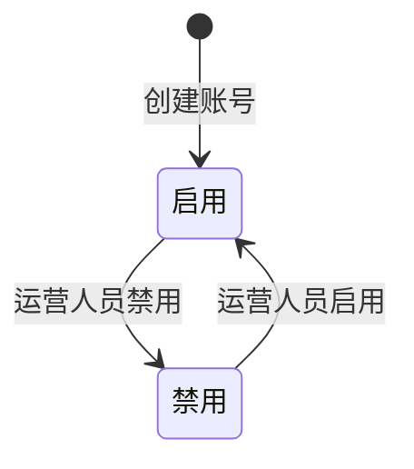
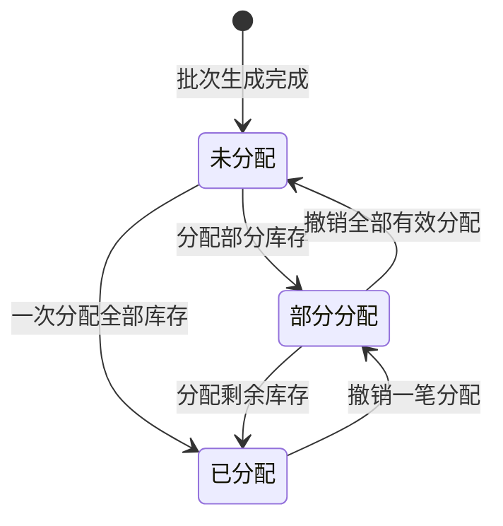
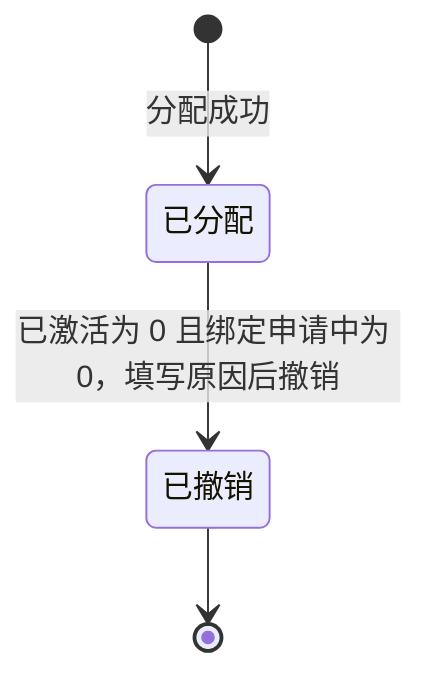
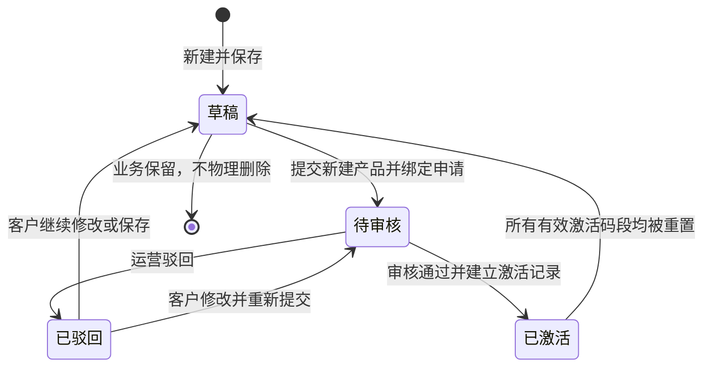
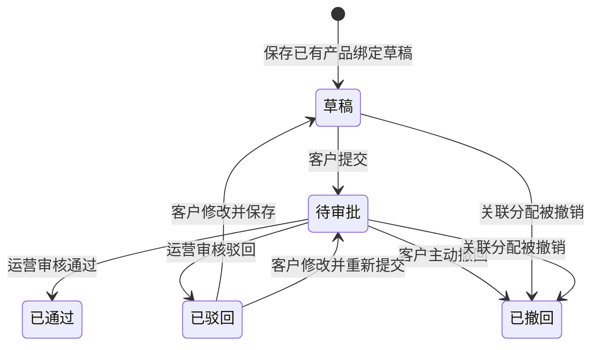
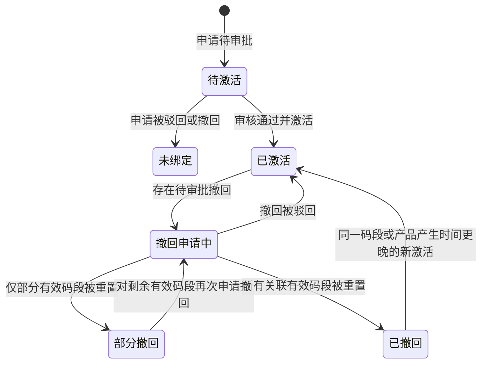
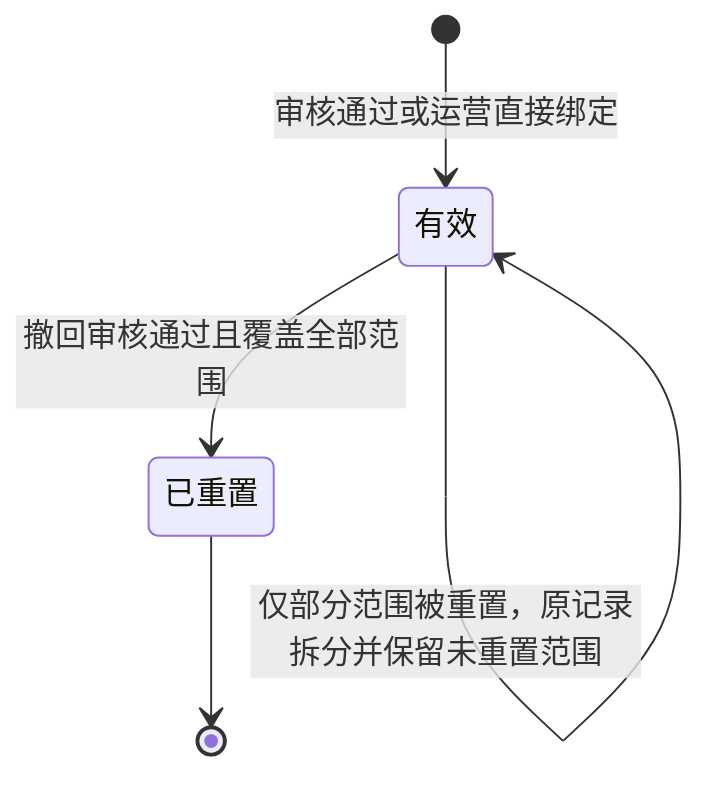
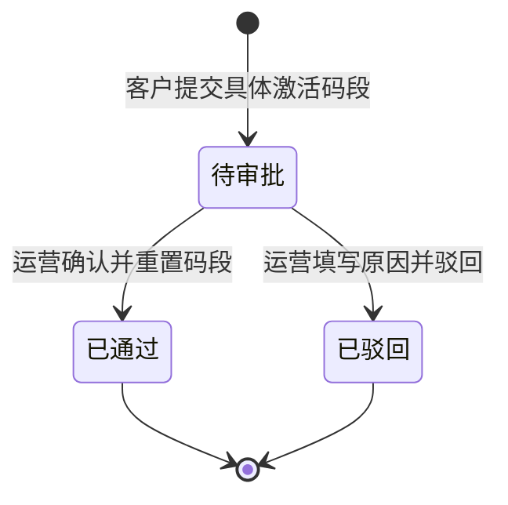
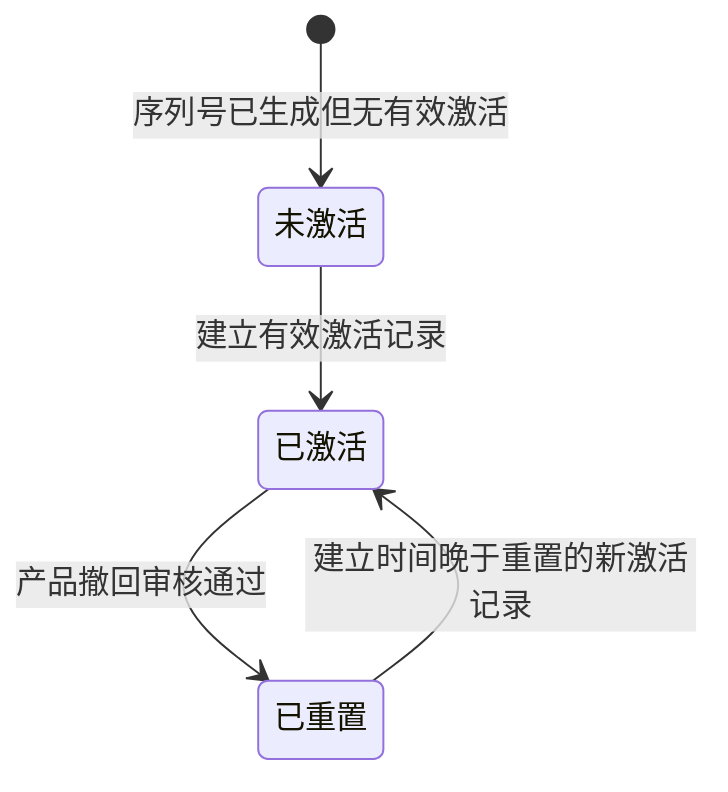

# 状态流转图

## 1. 账号状态

- 禁用不删除历史业务数据。
- 当前登录运营账号不能禁用自身。
- 登录和每个写操作都应检查账号仍为启用状态。

## 2. 库存批次分配状态

库存状态不是数据库人工修改状态，而是根据有效分配区间计算：

| 状态 | 判断条件 |
| --- | --- |
| 未分配 | 有效分配区间数量为 0 |
| 部分分配 | 有效分配数量大于 0 且剩余库存大于 0 |
| 已分配 | 剩余库存为 0 |

## 3. 分配订单状态

已撤销为终态。需要再次分配时应创建新的分配订单，不恢复旧订单。

## 4. 产品状态

说明：

- 产品“已激活”表示至少存在一个有效激活码段。
- 产品撤回申请待审批时，产品状态仍为“已激活”。
- 只有部分码段被重置且仍有其他有效激活时，产品仍为“已激活”。
- 审核结果历史不应随着产品后续状态变化被覆盖。

## 5. 绑定申请审核状态

`已通过`、`已撤回`为终态；已驳回记录重新提交时可复用原申请并清空旧处理结果，也可建立版本表保留每次提交版本。

## 6. 当前绑定状态

当前绑定状态与绑定申请审核状态是两个维度。审核结果保留历史，当前绑定状态根据申请、激活和撤回记录派生。

| 当前绑定状态 | 计算规则 |
| --- | --- |
| 待激活 | 绑定申请待审批 |
| 未绑定 | 申请已驳回、已撤回，且无有效激活 |
| 已激活 | 至少存在有效激活，且无匹配的待审批撤回 |
| 撤回申请中 | 存在覆盖关联激活记录的待审批撤回申请 |
| 部分撤回 | 同一申请或产品同时存在有效和已重置激活范围 |
| 已撤回 | 关联激活范围已全部重置 |

## 7. 激活记录状态

正式实现中，部分撤回建议采用以下任一方案：

1. 将原激活区间拆为“已重置区间”和一个或两个“有效区间”；或
2. 保留原激活记录，另建不可重叠的重置区间表，所有有效量和扫码解析按差集计算。

不应仅修改一个累计数量而不保留具体区间。

## 8. 撤回申请状态

| 流转 | 前置条件 | 数据影响 |
| --- | --- | --- |
| 待审批 → 已通过 | 申请的每个明细仍能精确匹配有效激活记录 | 重置区间、回滚订单/客户/产品有效码量、发送通知 |
| 待审批 → 已驳回 | 必须填写驳回原因 | 激活关系和数量不变、发送通知 |

## 9. 扫码状态

预览是独立展示模式，不属于真实序列号的生命周期状态。

扫码解析优先级：

1. 预览参数存在时返回预览。
2. 查找覆盖该序列号的最新有效激活。
3. 查找覆盖该序列号的最近已通过撤回重置。
4. 有效激活时间晚于重置时间时返回已激活。
5. 否则有重置返回已重置，无重置返回未激活。

## 10. 状态联动表

| 业务动作 | 库存批次 | 分配订单 | 产品 | 绑定申请 | 激活记录 | 撤回申请 | 扫码结果 |
| --- | --- | --- | --- | --- | --- | --- | --- |
| 生成码段 | 未分配 | — | — | — | — | — | 未激活 |
| 分配客户 | 可能部分/全部分配 | 已分配 | — | — | — | — | 未激活 |
| 提交绑定 | 不变 | 已分配 | 待审核或保持已激活 | 待审批 | — | — | 未激活 |
| 绑定通过 | 不变 | 已分配 | 已激活 | 已通过 | 有效 | — | 已激活 |
| 绑定驳回 | 不变 | 已分配 | 已驳回或保持已激活 | 已驳回 | — | — | 原状态 |
| 撤销分配 | 释放对应库存 | 已撤销 | 组合申请解除 | 未处理申请变已撤回 | 必须不存在 | — | 未激活 |
| 提交产品撤回 | 不变 | 已分配 | 已激活 | 历史不变 | 有效 | 待审批 | 仍已激活 |
| 撤回驳回 | 不变 | 已分配 | 已激活 | 历史不变 | 有效 | 已驳回 | 已激活 |
| 撤回通过 | 不变 | 已分配 | 有剩余则已激活，否则草稿 | 历史仍已通过 | 全部或部分已重置 | 已通过 | 对应码已重置 |

