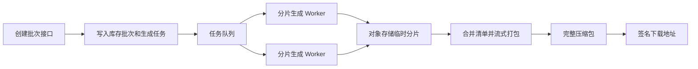

# 后端落地说明

## 1. 目标

当前原型在浏览器中完成计算，正式系统必须把权限、号段分配、码段占用、状态流转和审计放在服务端。前端只负责提交意图和展示结果，不能成为业务一致性的最终判断方。

## 2. 事务边界

以下操作必须在单个数据库事务中完成：

### 2.1 分配码段

1. 锁定库存批次或对应空闲区间。
2. 重新计算空闲连续范围。
3. 校验客户启用状态和分配数量。
4. 创建分配订单。
5. 提交事务后返回订单。

### 2.2 撤销分配

1. 锁定分配订单。
2. 重新计算有效激活量和待审批量。
3. 仅两者都为 0 时更新订单为已撤销。
4. 取消关联待处理绑定流程并记录原因。
5. 库存空闲范围由订单状态自动恢复。

### 2.3 绑定审核通过或运营直接绑定

1. 锁定订单和待处理申请。
2. 重新计算有效激活区间、待审批区间和空闲区间。
3. 校验客户、产品和订单归属一致。
4. 写入激活记录。
5. 更新申请和产品状态。
6. 写入审计事件和通知事件。

### 2.4 撤回审核通过

1. 锁定撤回申请和涉及的激活记录。
2. 逐条验证申请明细仍精确匹配。
3. 拆分或写入重置区间。
4. 重算订单、客户和产品有效码量。
5. 更新撤回申请并写入通知事件。

## 3. 并发与区间约束

- 同一库存批次的分配操作必须串行化或使用可证明安全的区间锁策略。
- 同一订单的绑定提交、审核、运营直接绑定和撤回审核必须防止区间并发冲突。
- PostgreSQL 可使用范围类型和排他约束；其他数据库可维护区间表并在事务中加悲观锁。
- 数据库至少应阻止：
  - 有效分配订单在同一库存批次内重叠。
  - 有效激活记录在同一订单内重叠。
  - 待审批申请与有效激活或其他待审批申请重叠。
  - 重置范围超出原激活范围。
- 所有审核接口必须带 `version` 或幂等键，重复点击不能重复累计数量。

## 4. 派生数量

建议以具体区间记录为事实来源：

```text
库存已分配量 = 有效分配订单区间并集数量
订单已激活量 = 有效激活区间并集数量
订单申请中量 = 待审批申请区间并集数量
订单剩余可用量 = 订单总量 - 已激活量 - 申请中量
产品有效码量 = 该产品全部有效激活区间数量
客户已激活量 = 该客户全部有效激活区间数量
```

可保存汇总列提升查询性能，但必须：

- 在同一事务中更新；
- 提供定期核对和重算任务；
- 出现不一致时以区间明细为准修复。

## 5. 二维码异步生成架构

百万级二维码任务建议流程：



实现要求：

- 一个任务按可配置数量分片，不在内存中同时保存全部 SVG。
- 二维码生成、清单写入和 ZIP 打包使用流式 I/O。
- Worker 支持断点重试，分片任务必须幂等。
- 主任务记录总数、已完成数、失败数、进度、失败原因和重试次数。
- 压缩包完成后计算 SHA-256，并记录文件大小。
- 完整包和部分样例使用同一二维码生成算法，确保内容一致。
- 下载接口返回签名地址，不由应用服务器反复转发大文件。

## 6. 建议的命令型接口

以下仅定义业务边界，具体 REST 或 RPC 风格由后端项目约定：

| 命令 | 关键输入 | 关键输出 |
| --- | --- | --- |
| 创建库存批次 | 数量、前缀、宽、高、备注、幂等键 | 批次、序列号范围、生成任务 |
| 创建下载任务 | 批次、模式、数量 | 下载任务或已完成文件 |
| 分配码段 | 批次、客户、空闲区间、数量、备注、幂等键 | 分配订单 |
| 撤销分配 | 订单、原因、版本 | 已撤销订单和归还数量 |
| 保存产品草稿 | 订单、产品资料、申请设置 | 产品草稿和版本 |
| 提交绑定申请 | 产品、订单、具体码段、数量、版本 | 待审批申请 |
| 审核绑定申请 | 申请、通过/驳回、原因、版本、幂等键 | 申请结果和激活记录 |
| 运营直接绑定 | 订单、产品、数量、版本、幂等键 | 激活记录 |
| 提交撤回申请 | 产品、激活明细、原因 | 待审批撤回申请 |
| 审核撤回申请 | 申请、通过/驳回、原因、版本、幂等键 | 撤回结果和重置明细 |
| 解析扫码状态 | 单个序列号 | 扫码状态和公开视图模型 |

查询接口不得复用命令接口产生副作用；扫码计数可通过独立事件异步写入。

## 7. 错误码建议

| 错误码 | 场景 |
| --- | --- |
| `ACCOUNT_DISABLED` | 当前账号已禁用 |
| `CUSTOMER_SCOPE_DENIED` | 访问其他客户数据 |
| `CODE_RANGE_INVALID` | 码段格式或数量不匹配 |
| `CODE_RANGE_CONFLICT` | 码段已被其他分配、申请或激活占用 |
| `INSUFFICIENT_CONTIGUOUS_RANGE` | 总量可能足够但没有足够长的连续区间 |
| `ORDER_RECALLED` | 分配订单已撤销 |
| `ORDER_RECALL_BLOCKED` | 已有激活或待审批申请，不能撤销分配 |
| `REQUEST_ALREADY_DECIDED` | 申请已处理 |
| `REQUEST_VERSION_CONFLICT` | 页面版本过期 |
| `WITHDRAWAL_SEGMENT_CHANGED` | 撤回码段不再匹配有效激活记录 |
| `QR_TASK_NOT_READY` | 二维码包仍在生成 |

前端应使用错误码决定刷新、提示或返回列表，不依赖解析后端中文错误文案。

## 8. 审计日志

以下操作必须写审计日志：

- 运营账号和客户账号的创建、编辑、启用、禁用和密码重置。
- 库存批次创建、生成失败、重试和下载包生成。
- 码段分配和撤销分配。
- 产品资料的运营编辑。
- 绑定申请提交、主动撤回、通过和驳回。
- 运营直接绑定。
- 产品撤回申请的通过和驳回。
- 文件上传、替换和删除。

审计字段至少包括操作者、角色、动作、业务对象、对象编号、操作前摘要、操作后摘要、原因、时间、IP 和请求 ID。

## 9. 消息可靠性

- 业务事务内写入 `outbox_event`，事务提交后由消息任务生成站内信。
- 事件消费者必须幂等，避免重复消息。
- 消息正文可以保留快照，但跳转时仍需校验当前数据权限。
- 码段分配不触发客户站内信；绑定审核和撤回审核结果触发。

## 10. 文件与安全

- 密码使用 Argon2id 或 bcrypt 等安全算法存储。
- 客户证照、法人身份证和后台产品附件默认私有。
- 扫码端公开文件应经过发布流程生成公开副本或受控签名地址。
- 上传时校验 MIME、扩展名、文件头、大小并执行病毒扫描。
- 不允许将浏览器 Data URL 直接作为正式数据库内容。
- 二维码 URL 如需防伪，应增加不可预测的校验令牌；仅使用连续序列号容易被遍历。

## 11. 测试重点

- 同一库存批次并发分配相邻或重叠区间。
- 同一订单并发提交多个绑定申请。
- 审核通过瞬间另一个申请占用相同码段。
- 撤销分配与绑定审核同时发生。
- 撤回审核与新激活同时发生。
- 部分撤回后剩余有效区间和扫码结果是否正确。
- 全部撤回后产品状态、订单数量和扫码状态是否一致。
- 重置后再次激活，扫码是否按时间返回新产品。
- 百万级任务的内存、磁盘、失败重试和下载完整性。
- 客户横向越权访问订单、产品、附件和消息。

