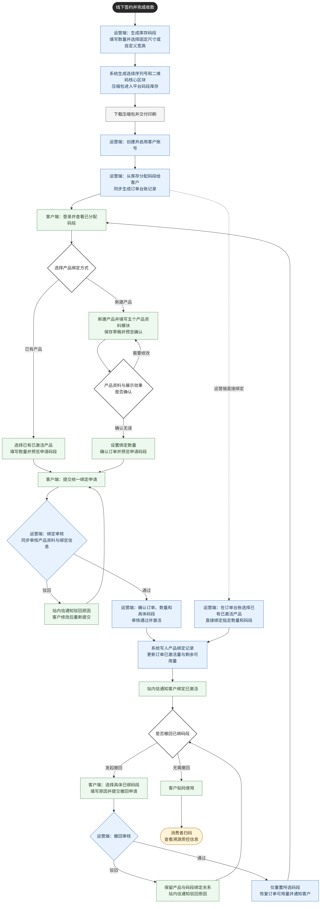

# 全链路业务流程图

本图对应当前多页面原型的业务逻辑：运营端先生成平台库存码段，再按需分配给客户；客户使用已分配码段发起产品绑定，运营端在一次审核中同时处理产品资料和绑定信息。

颜色说明：蓝色为运营端或系统动作，绿色为客户端动作，灰色为线下环节，浅黄色为消费者扫码端，白色菱形为流程判断。

可编辑源文件：[end-to-end-business-flow.mmd](./end-to-end-business-flow.mmd)
