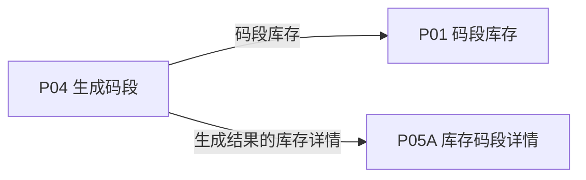
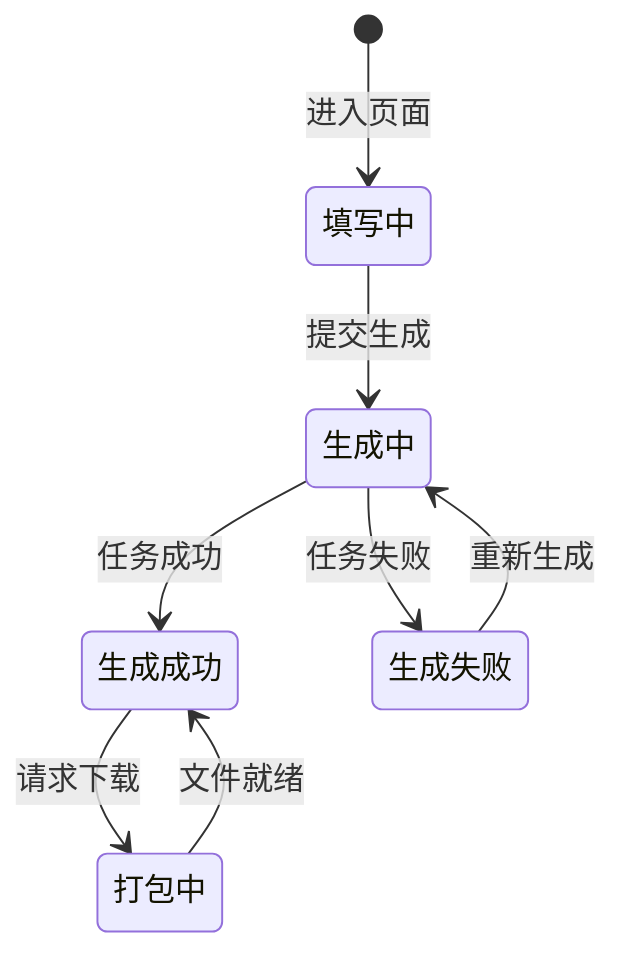

# 《页面功能规格说明书》

> 页面名称：生成码段  
> 页面编号：P04  
> 文档类型：页面级功能规格

## 01 页面基本信息

| 项目 | 内容 |
| --- | --- |
| 页面名称 | 生成码段 |
| 页面编号 | P04 |
| 所属模块 | 运营端 / 码段生成 |
| 使用角色 | 启用状态的运营人员 |
| 页面入口 | `/prototype-multipage/pages/ops/create-order.html`；从码段库存页或运营端主导航进入“生成码段”。 |

## 02 页面业务说明

### 页面目标

生成平台库存二维码码段，预览二维码输出效果，并提供样例下载和完整压缩包下载。

### 业务场景

单次二维码生成量可能达到百万级，正式系统需要通过后端异步任务完成号段分配、文件生成和压缩包准备。

- 手工填写宽度和高度
- 实时预览二维码及其下方序列号
- 提交生成任务并查看加载状态
- 按自定义数量部分下载

### 业务对象

| 业务对象 | 页面内职责 | 数据来源与落地要求 |
| --- | --- | --- |
| 库存码段批次 | 页面初始化、关联查询或状态计算 | 当前原型为 localStorage / 页面上下文；正式接口待后端契约确认 |
| 码段生成任务 | 页面初始化、关联查询或状态计算 | 当前原型为 localStorage / 页面上下文；正式接口待后端契约确认 |
| 压缩包任务 | 页面初始化、关联查询或状态计算 | 当前原型为 localStorage / 页面上下文；正式接口待后端契约确认 |

### 业务关系

## 03 页面功能

### 新增

- 提交生成任务并查看加载状态
- 生成后进入码段库存

### 查看

- 实时预览二维码及其下方序列号

### 其他操作

- 手工填写宽度和高度
- 按自定义数量部分下载
- 下载完整压缩包

## 04 数据定义

| 字段 | 类型 | 必填 | 唯一性 | 默认值 | 可修改性 | 数据来源 |
| --- | --- | --- | --- | --- | --- | --- |
| 生成数量 | 整数 | 是 | 否 | 0 | 是（提交生成前） | 库存码段批次 |
| 二维码宽度 | 小数/字符串 | 是 | 否 | — | 是（提交生成前） | 库存码段批次 |
| 二维码高度 | 小数/字符串 | 是 | 否 | — | 是（提交生成前） | 库存码段批次 |
| 备注 | 多行文本 | 否 | 否 | — | 是（提交生成前） | 库存码段批次 |
| 起始序列号 | 字符串 | 是 | 全局唯一 | — | 否（系统维护） | 库存码段批次 |
| 结束序列号 | 字符串 | 是 | 全局唯一 | — | 否（系统维护） | 库存码段批次 |
| 二维码预览 | 字符串 | 是 | 否 | — | 否（系统维护） | 库存码段批次 |
| 生成进度 | 字符串 | 是 | 否 | — | 否（系统维护） | 库存码段批次 |

> “必填”表示业务记录或提交动作必须具备该字段；“可修改性”由后端根据当前业务状态最终校验。

## 05 业务规则

### 数据校验规则

- 宽高范围均为 8 至 300 mm
- 序列号范围必须连续且全局不重复
- 输入未通过校验时不得提交
- 单次生成数量为 1 至 10,000,000
- 生成失败可重试且不得占用重复号段

### 操作规则

- 提交生成任务并查看加载状态
- 生成后进入码段库存
- 手工填写宽度和高度
- 按自定义数量部分下载
- 下载完整压缩包
- 大批量生成和完整下载应由后端异步任务完成
- 部分下载从码段起点开始，只填写数量且不另设固定业务上限

### 数据一致性规则

- 生成成功后库存新增唯一连续码段
- 页面数据以后端当前有效业务关系为准，关联页面使用同一数据口径。

## 06 状态管理

### 状态定义

| 状态 | 定义 |
| --- | --- |
| 填写中 | 编辑生成参数 |
| 生成中 | 后端异步生成码段 |
| 生成成功 | 库存批次已建立 |
| 生成失败 | 任务失败且可重试 |
| 打包中 | 正在生成下载文件 |

### 状态转换图

### 转换条件

| 当前状态 | 目标状态 | 转换条件 |
| --- | --- | --- |
| 初始 | 填写中 | 进入页面 |
| 填写中 | 生成中 | 提交生成 |
| 生成中 | 生成成功 | 任务成功 |
| 生成中 | 生成失败 | 任务失败 |
| 生成失败 | 生成中 | 重新生成 |
| 生成成功 | 打包中 | 请求下载 |
| 打包中 | 生成成功 | 文件就绪 |

### 禁止转换

- 状态转换图中未定义的转换一律禁止。
- 前端不得直接指定目标状态，后端必须根据当前状态和业务条件执行转换。
- 后续业务过程不得覆盖历史审核或操作状态。

## 07 权限管理

### 页面权限

- 仅启用状态的运营人员可访问。

### 操作权限

- 操作权限按当前账号状态、数据权限和业务前置条件判断；本页涉及：提交生成任务并查看加载状态、生成后进入码段库存、实时预览二维码及其下方序列号、手工填写宽度和高度、按自定义数量部分下载、下载完整压缩包。

### 数据权限

- 运营端可访问平台业务数据；涉及账号管理、审核和撤销的操作必须记录操作人及时间。

## 08 系统交互

### 内部系统交互

| 交互对象 | 交互内容 | 调用时机 | 成功处理 | 失败处理 |
| --- | --- | --- | --- | --- |
| 库存码段批次 | 页面初始化、关联查询或状态计算 | 页面初始化或关联数据变更后 | 返回最新数据并刷新相关区域 | 保留当前上下文并允许重试 |
| 码段生成任务 | 页面初始化、关联查询或状态计算 | 页面初始化或关联数据变更后 | 返回最新数据并刷新相关区域 | 保留当前上下文并允许重试 |
| 压缩包任务 | 页面初始化、关联查询或状态计算 | 页面初始化或关联数据变更后 | 返回最新数据并刷新相关区域 | 保留当前上下文并允许重试 |
| 查询服务 | 按页面入口参数读取当前业务对象。查询参数、分页、排序和筛选条件应由正式接口统一接收。 | 查询、筛选、排序或分页时 | 返回匹配数据和总数 | 保留查询条件并允许重试 |
| 提交生成任务并查看加载状态 | 提交当前业务对象标识、操作字段、操作人和客户端请求标识；后端重新校验业务前置条件。 | 用户确认提交时 | 返回最新状态并刷新关联数据 | 不写入成功状态，返回明确原因 |
| 按自定义数量部分下载 | 提交当前业务对象标识、操作字段、操作人和客户端请求标识；后端重新校验业务前置条件。 | 用户确认提交时 | 返回最新状态并刷新关联数据 | 不写入成功状态，返回明确原因 |
| 下载完整压缩包 | 提交当前业务对象标识、操作字段、操作人和客户端请求标识；后端重新校验业务前置条件。 | 用户确认提交时 | 返回最新状态并刷新关联数据 | 不写入成功状态，返回明确原因 |

### 第三方系统交互

| 第三方对象 | 交互内容 | 调用时机 | 成功处理 | 失败处理 |
| --- | --- | --- | --- | --- |
| 二维码生成服务 / 对象存储 / 异步任务服务 | 二维码生成库、对象存储及异步压缩包任务。 | 读取资源或执行异步任务时 | 返回可访问资源或任务结果 | 记录失败原因并支持安全重试 |

> 当前原型使用浏览器 localStorage 模拟数据存取；正式接口路径、请求方法、错误码和超时阈值由前后端联调时确认。

## 09 异常与边界

### 重复操作

- 写操作必须携带客户端请求标识并保证幂等；重复提交不得重复创建记录、扣减数量或发送通知。

### 并发处理

- 后端在提交时重新校验记录版本、当前状态及数量；发生冲突时拒绝本次操作并返回最新数据。

### 超时处理

- 请求超时时保留当前查询或表单上下文，不得预先写入成功状态；重试时沿用原幂等标识。

### 第三方异常

- 第三方资源或异步任务失败时，保留本地业务记录和失败原因，不得标记为已完成，并支持安全重试。

### 数据异常

- 查询成功但无记录时展示明确空状态，保留可用的新增、返回或重试入口。
- 未登录、账号禁用、越权访问或数据不属于当前主体时终止操作，并返回无权限或安全的空结果。

## 10 前端交互补充

### 页面结构

| 页面区域 | 内容与职责 |
| --- | --- |
| 页面标题区 | 页面名称、返回或步骤状态 |
| 表单区 | 业务字段、校验和附件 |
| 预览区 | 二维码或产品效果预览 |
| 操作区 | 保存、提交、下载或返回 |

### 页面元素

| 元素 | 说明 |
| --- | --- |
| 生成数量 | 展示或维护生成数量 |
| 二维码宽度 | 展示或维护二维码宽度 |
| 二维码高度 | 展示或维护二维码高度 |
| 备注 | 展示或维护备注 |
| 起始序列号 | 展示或维护起始序列号 |
| 结束序列号 | 展示或维护结束序列号 |
| 二维码预览 | 展示或维护二维码预览 |
| 生成进度 | 展示或维护生成进度 |

### 按钮与弹窗

| 类型 | 操作 | 前端要求 |
| --- | --- | --- |
| 新增 | 提交生成任务并查看加载状态 | 按业务状态与操作权限决定显示和可用性 |
| 新增 | 生成后进入码段库存 | 按业务状态与操作权限决定显示和可用性 |
| 查看 | 实时预览二维码及其下方序列号 | 按业务状态与操作权限决定显示和可用性 |
| 其他操作 | 手工填写宽度和高度 | 按业务状态与操作权限决定显示和可用性 |
| 其他操作 | 按自定义数量部分下载 | 按业务状态与操作权限决定显示和可用性 |
| 其他操作 | 下载完整压缩包 | 按业务状态与操作权限决定显示和可用性 |

### 交互反馈

- 页面在桌面和窄屏下无内容重叠，长列表支持分页，宽表支持横向滚动。
- 页面区域、字段名称、状态、权限和数据口径与关联页面保持一致。
- 加载中、成功、失败和空数据状态必须给出明确反馈。
- 实时预览二维码及其下方序列号
- 生成中显示明确进度且避免重复提交
- 下载任务未完成时显示处理中状态
- 预览和下载文件中的二维码下方均包含序列号
- 部分下载和完整下载是两个独立按钮
