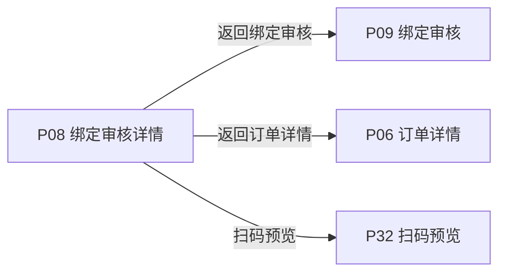
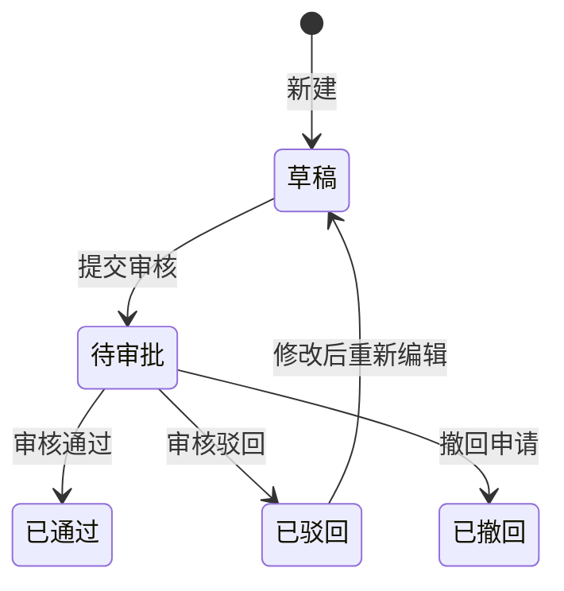

# 《页面功能规格说明书》

> 页面名称：绑定审核详情  
> 页面编号：P08  
> 文档类型：页面级功能规格

## 01 页面基本信息

| 项目 | 内容 |
| --- | --- |
| 页面名称 | 绑定审核详情 |
| 页面编号 | P08 |
| 所属模块 | 运营端 / 绑定审核 |
| 使用角色 | 启用状态的运营人员 |
| 页面入口 | `/prototype-multipage/pages/ops/bind-request-detail.html`；从绑定审核列表或订单详情进入，必须携带产品或申请标识。 |

## 02 页面业务说明

### 页面目标

核对产品资料、订单、申请数量和具体码段，并完成绑定审核或只读查看。

### 业务场景

客户提交的产品资料和绑定码段必须由运营端统一核对，审核结果与后续当前绑定状态需要分别记录。

- 分步骤查看五类产品资料
- 查看图片和附件
- 运营端修正允许编辑的资料
- 审核通过并激活

### 业务对象

| 业务对象 | 页面内职责 | 数据来源与落地要求 |
| --- | --- | --- |
| 产品 | 页面初始化、关联查询或状态计算 | 当前原型为 localStorage / 页面上下文；正式接口待后端契约确认 |
| 绑定申请 | 页面初始化、关联查询或状态计算 | 当前原型为 localStorage / 页面上下文；正式接口待后端契约确认 |
| 分配订单 | 页面初始化、关联查询或状态计算 | 当前原型为 localStorage / 页面上下文；正式接口待后端契约确认 |
| 激活记录 | 页面初始化、关联查询或状态计算 | 当前原型为 localStorage / 页面上下文；正式接口待后端契约确认 |

### 业务关系

## 03 页面功能

### 编辑

- 运营端修正允许编辑的资料

### 查看

- 分步骤查看五类产品资料
- 查看图片和附件
- 返回来源列表

### 其他操作

- 审核通过并激活
- 填写原因后驳回

## 04 数据定义

| 字段 | 类型 | 必填 | 唯一性 | 默认值 | 可修改性 | 数据来源 |
| --- | --- | --- | --- | --- | --- | --- |
| 产品信息 | 字符串 | 是 | 否 | — | 否（系统维护） | 产品 |
| 企业信息 | 字符串 | 是 | 否 | — | 否（系统维护） | 产品 |
| 生产单位信息 | 字符串 | 是 | 否 | — | 否（系统维护） | 产品 |
| 质量信息 | 字符串 | 是 | 否 | — | 否（系统维护） | 产品 |
| 生产追溯信息 | 字符串 | 是 | 否 | — | 否（系统维护） | 产品 |
| 订单号 | 字符串 | 是 | 全局唯一 | — | 否（系统维护） | 分配订单 |
| 申请数量 | 整数 | 是 | 否 | 0 | 否（系统维护） | 绑定申请 |
| 绑定码段 | 字符串 | 是 | 业务范围内唯一 | — | 否（系统维护） | 绑定申请 |
| 申请状态 | 枚举 | 是 | 否 | 按业务初始状态 | 否（系统维护） | 绑定申请 |
| 当前绑定状态 | 枚举 | 是 | 否 | 按业务初始状态 | 否（系统维护） | 产品 |

> “必填”表示业务记录或提交动作必须具备该字段；“可修改性”由后端根据当前业务状态最终校验。

## 05 业务规则

### 数据校验规则

- 审核前重新校验客户、订单、产品、数量和码段可用性
- 驳回必须填写原因
- 审核通过创建唯一激活记录

### 操作规则

- 运营端修正允许编辑的资料
- 分步骤查看五类产品资料
- 查看图片和附件
- 返回来源列表
- 审核通过并激活
- 填写原因后驳回
- 审核结果状态和当前绑定状态分别表达，不因后续撤回改写历史审核结果
- 待审核显示通过和驳回操作
- 已通过、已驳回记录只读或按权限编辑资料
- 数据缺失时禁止通过并明确缺失字段

### 数据一致性规则

- 审核信息与申请提交内容一致
- 重复提交审核不会生成重复激活记录
- 通过或驳回后列表状态即时更新
- 页面数据以后端当前有效业务关系为准，关联页面使用同一数据口径。

## 06 状态管理

### 状态定义

| 状态 | 定义 |
| --- | --- |
| 草稿 | 资料尚未提交 |
| 待审批 | 已提交并占用申请码段 |
| 已通过 | 审核通过并形成激活记录 |
| 已驳回 | 审核驳回并释放码段 |
| 已撤回 | 客户撤回待处理申请 |

### 状态转换图

### 转换条件

| 当前状态 | 目标状态 | 转换条件 |
| --- | --- | --- |
| 初始 | 草稿 | 新建 |
| 草稿 | 待审批 | 提交审核 |
| 待审批 | 已通过 | 审核通过 |
| 待审批 | 已驳回 | 审核驳回 |
| 待审批 | 已撤回 | 撤回申请 |
| 已驳回 | 草稿 | 修改后重新编辑 |

### 禁止转换

- 状态转换图中未定义的转换一律禁止。
- 前端不得直接指定目标状态，后端必须根据当前状态和业务条件执行转换。
- 后续业务过程不得覆盖历史审核或操作状态。

## 07 权限管理

### 页面权限

- 仅启用状态的运营人员可访问。

### 操作权限

- 操作权限按当前账号状态、数据权限和业务前置条件判断；本页涉及：运营端修正允许编辑的资料、分步骤查看五类产品资料、查看图片和附件、返回来源列表、审核通过并激活、填写原因后驳回。

### 数据权限

- 运营端可访问平台业务数据；涉及账号管理、审核和撤销的操作必须记录操作人及时间。

## 08 系统交互

### 内部系统交互

| 交互对象 | 交互内容 | 调用时机 | 成功处理 | 失败处理 |
| --- | --- | --- | --- | --- |
| 产品 | 页面初始化、关联查询或状态计算 | 页面初始化或关联数据变更后 | 返回最新数据并刷新相关区域 | 保留当前上下文并允许重试 |
| 绑定申请 | 页面初始化、关联查询或状态计算 | 页面初始化或关联数据变更后 | 返回最新数据并刷新相关区域 | 保留当前上下文并允许重试 |
| 分配订单 | 页面初始化、关联查询或状态计算 | 页面初始化或关联数据变更后 | 返回最新数据并刷新相关区域 | 保留当前上下文并允许重试 |
| 激活记录 | 页面初始化、关联查询或状态计算 | 页面初始化或关联数据变更后 | 返回最新数据并刷新相关区域 | 保留当前上下文并允许重试 |
| 查询服务 | 按页面入口参数读取当前业务对象。查询参数、分页、排序和筛选条件应由正式接口统一接收。 | 查询、筛选、排序或分页时 | 返回匹配数据和总数 | 保留查询条件并允许重试 |
| 运营端修正允许编辑的资料 | 提交当前业务对象标识、操作字段、操作人和客户端请求标识；后端重新校验业务前置条件。 | 用户确认提交时 | 返回最新状态并刷新关联数据 | 不写入成功状态，返回明确原因 |
| 审核通过并激活 | 提交当前业务对象标识、操作字段、操作人和客户端请求标识；后端重新校验业务前置条件。 | 用户确认提交时 | 返回最新状态并刷新关联数据 | 不写入成功状态，返回明确原因 |
| 填写原因后驳回 | 提交当前业务对象标识、操作字段、操作人和客户端请求标识；后端重新校验业务前置条件。 | 用户确认提交时 | 返回最新状态并刷新关联数据 | 不写入成功状态，返回明确原因 |

### 第三方系统交互

| 第三方对象 | 交互内容 | 调用时机 | 成功处理 | 失败处理 |
| --- | --- | --- | --- | --- |
| 对象存储 / 公共扫码服务 | 文件或图片资源由对象存储提供；扫码页面按公开 URL 读取。 | 读取资源或执行异步任务时 | 返回可访问资源或任务结果 | 记录失败原因并支持安全重试 |

> 当前原型使用浏览器 localStorage 模拟数据存取；正式接口路径、请求方法、错误码和超时阈值由前后端联调时确认。

## 09 异常与边界

### 重复操作

- 写操作必须携带客户端请求标识并保证幂等；重复提交不得重复创建记录、扣减数量或发送通知。

### 并发处理

- 后端在提交时重新校验记录版本、当前状态及数量；发生冲突时拒绝本次操作并返回最新数据。

### 超时处理

- 请求超时时保留当前查询或表单上下文，不得预先写入成功状态；重试时沿用原幂等标识。

### 第三方异常

- 第三方资源或异步任务失败时，保留本地业务记录和失败原因，不得标记为已完成，并支持安全重试。

### 数据异常

- 查询成功但无记录时展示明确空状态，保留可用的新增、返回或重试入口。
- 未登录、账号禁用、越权访问或数据不属于当前主体时终止操作，并返回无权限或安全的空结果。

## 10 前端交互补充

### 页面结构

| 页面区域 | 内容与职责 |
| --- | --- |
| 页面标题区 | 页面名称、返回和主要业务操作 |
| 基础信息区 | 当前业务对象的关键信息 |
| 关联记录区 | 关联对象列表、筛选和操作 |
| 弹窗区 | 绑定、撤销或确认操作 |

### 页面元素

| 元素 | 说明 |
| --- | --- |
| 产品信息 | 展示或维护产品信息 |
| 企业信息 | 展示或维护企业信息 |
| 生产单位信息 | 展示或维护生产单位信息 |
| 质量信息 | 展示或维护质量信息 |
| 生产追溯信息 | 展示或维护生产追溯信息 |
| 订单号 | 展示或维护订单号 |
| 申请数量 | 展示或维护申请数量 |
| 绑定码段 | 展示或维护绑定码段 |
| 申请状态 | 展示或维护申请状态 |
| 当前绑定状态 | 展示或维护当前绑定状态 |

### 按钮与弹窗

| 类型 | 操作 | 前端要求 |
| --- | --- | --- |
| 编辑 | 运营端修正允许编辑的资料 | 按业务状态与操作权限决定显示和可用性 |
| 查看 | 分步骤查看五类产品资料 | 按业务状态与操作权限决定显示和可用性 |
| 查看 | 查看图片和附件 | 按业务状态与操作权限决定显示和可用性 |
| 查看 | 返回来源列表 | 按业务状态与操作权限决定显示和可用性 |
| 其他操作 | 审核通过并激活 | 按业务状态与操作权限决定显示和可用性 |
| 其他操作 | 填写原因后驳回 | 按业务状态与操作权限决定显示和可用性 |

### 交互反馈

- 图片结束后立即衔接下一项内容，不使用固定容器高度，不在图片下方保留多余留白。
- 产品图片按原始宽高比完整展示，长图容器高度随图片内容自适应，不裁剪、不拉伸。
- 页面在桌面和窄屏下无内容重叠，长列表支持分页，宽表支持横向滚动。
- 页面区域、字段名称、状态、权限和数据口径与关联页面保持一致。
- 加载中、成功、失败和空数据状态必须给出明确反馈。
