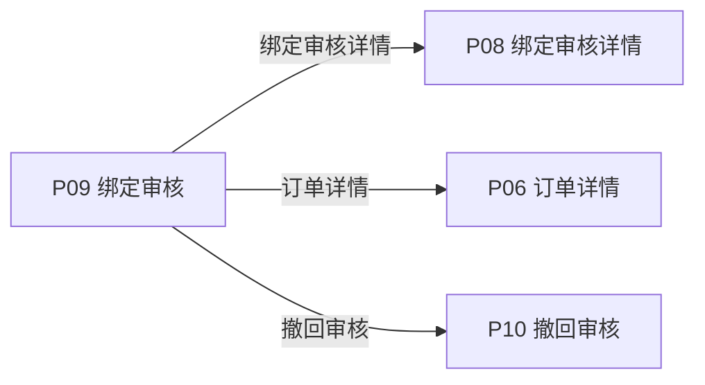
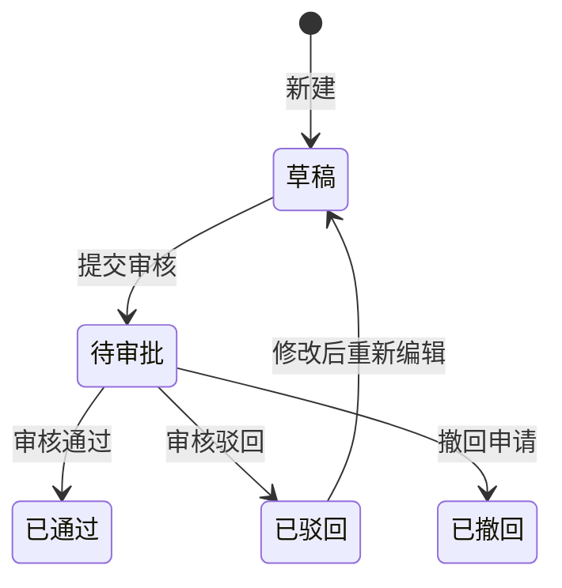

# 《页面功能规格说明书》

> 页面名称：绑定审核  
> 页面编号：P09  
> 文档类型：页面级功能规格

## 01 页面基本信息

| 项目 | 内容 |
| --- | --- |
| 页面名称 | 绑定审核 |
| 页面编号 | P09 |
| 所属模块 | 运营端 / 绑定审核 |
| 使用角色 | 启用状态的运营人员 |
| 页面入口 | `/prototype-multipage/pages/ops/bind-requests.html`；从运营端主导航进入“绑定审核”，也可从订单相关入口带条件进入。 |

## 02 页面业务说明

### 页面目标

统一查看和处理新建产品并绑定、已有产品追加绑定两类申请，并追踪审核结果与当前绑定状态。

### 业务场景

客户提交的产品资料和绑定码段必须由运营端统一核对，审核结果与后续当前绑定状态需要分别记录。

- 按客户、订单、产品、批次、大类、审核状态、当前绑定状态和日期筛选
- 进入申请详情
- 处理待审核申请
- 查看产品资料

### 业务对象

| 业务对象 | 页面内职责 | 数据来源与落地要求 |
| --- | --- | --- |
| 产品 | 页面初始化、关联查询或状态计算 | 当前原型为 localStorage / 页面上下文；正式接口待后端契约确认 |
| 绑定申请 | 页面初始化、关联查询或状态计算 | 当前原型为 localStorage / 页面上下文；正式接口待后端契约确认 |
| 分配订单 | 页面初始化、关联查询或状态计算 | 当前原型为 localStorage / 页面上下文；正式接口待后端契约确认 |
| 激活记录 | 页面初始化、关联查询或状态计算 | 当前原型为 localStorage / 页面上下文；正式接口待后端契约确认 |
| 撤回申请 | 页面初始化、关联查询或状态计算 | 当前原型为 localStorage / 页面上下文；正式接口待后端契约确认 |

### 业务关系

## 03 页面功能

### 查询

- 按客户、订单、产品、批次、大类、审核状态、当前绑定状态和日期筛选

### 查看

- 进入申请详情
- 查看产品资料

### 其他操作

- 处理待审核申请

## 04 数据定义

| 字段 | 类型 | 必填 | 唯一性 | 默认值 | 可修改性 | 数据来源 |
| --- | --- | --- | --- | --- | --- | --- |
| 申请编号 | 字符串 | 是 | 全局唯一 | — | 否（系统维护） | 绑定申请 |
| 产品名称 | 字符串 | 是 | 否 | — | 否（系统维护） | 产品 |
| 产品批次 | 字符串 | 是 | 业务范围内唯一 | — | 否（系统维护） | 产品 |
| 产品大类 | 枚举 | 是 | 否 | — | 否（系统维护） | 产品 |
| 客户名称 | 字符串 | 是 | 否 | — | 否（系统维护） | 产品 |
| 订单号 | 字符串 | 是 | 全局唯一 | — | 否（系统维护） | 分配订单 |
| 申请码段 | 字符串 | 是 | 业务范围内唯一 | — | 否（系统维护） | 绑定申请 |
| 数量 | 整数 | 是 | 否 | 0 | 否（系统维护） | 产品 |
| 申请时间 | 日期时间 | 是 | 否 | — | 否（系统维护） | 绑定申请 |
| 审核状态 | 枚举 | 是 | 否 | 按业务初始状态 | 否（系统维护） | 产品 |
| 当前绑定状态 | 枚举 | 是 | 否 | 按业务初始状态 | 否（系统维护） | 产品 |

> “必填”表示业务记录或提交动作必须具备该字段；“可修改性”由后端根据当前业务状态最终校验。

## 05 业务规则

### 数据校验规则

- 当前绑定状态列必须提供筛选
- 无匹配结果时保留筛选条件

### 计算规则

- 当前绑定状态独立计算：申请中、已激活、撤回申请中、部分撤回、已撤回等

### 操作规则

- 未选择其他排序条件时，列表默认按申请时间倒序排列，最新记录在前；用户主动选择排序后按所选规则执行。
- 按客户、订单、产品、批次、大类、审核状态、当前绑定状态和日期筛选
- 进入申请详情
- 查看产品资料
- 处理待审核申请
- 审核状态保留历史结果：待审批、已通过、已驳回、已撤回
- 待审批记录可审核
- 已通过记录可能因后续撤回显示不同当前绑定状态

### 数据一致性规则

- 审核结果和当前绑定状态不混用
- 筛选结果与列表状态标签一致
- 页面数据以后端当前有效业务关系为准，关联页面使用同一数据口径。

## 06 状态管理

### 状态定义

| 状态 | 定义 |
| --- | --- |
| 草稿 | 资料尚未提交 |
| 待审批 | 已提交并占用申请码段 |
| 已通过 | 审核通过并形成激活记录 |
| 已驳回 | 审核驳回并释放码段 |
| 已撤回 | 客户撤回待处理申请 |

### 状态转换图

### 转换条件

| 当前状态 | 目标状态 | 转换条件 |
| --- | --- | --- |
| 初始 | 草稿 | 新建 |
| 草稿 | 待审批 | 提交审核 |
| 待审批 | 已通过 | 审核通过 |
| 待审批 | 已驳回 | 审核驳回 |
| 待审批 | 已撤回 | 撤回申请 |
| 已驳回 | 草稿 | 修改后重新编辑 |

### 禁止转换

- 状态转换图中未定义的转换一律禁止。
- 前端不得直接指定目标状态，后端必须根据当前状态和业务条件执行转换。
- 后续业务过程不得覆盖历史审核或操作状态。

## 07 权限管理

### 页面权限

- 仅启用状态的运营人员可访问。

### 操作权限

- 操作权限按当前账号状态、数据权限和业务前置条件判断；本页涉及：按客户、订单、产品、批次、大类、审核状态、当前绑定状态和日期筛选、进入申请详情、查看产品资料、处理待审核申请。

### 数据权限

- 运营端可访问平台业务数据；涉及账号管理、审核和撤销的操作必须记录操作人及时间。

## 08 系统交互

### 内部系统交互

| 交互对象 | 交互内容 | 调用时机 | 成功处理 | 失败处理 |
| --- | --- | --- | --- | --- |
| 产品 | 页面初始化、关联查询或状态计算 | 页面初始化或关联数据变更后 | 返回最新数据并刷新相关区域 | 保留当前上下文并允许重试 |
| 绑定申请 | 页面初始化、关联查询或状态计算 | 页面初始化或关联数据变更后 | 返回最新数据并刷新相关区域 | 保留当前上下文并允许重试 |
| 分配订单 | 页面初始化、关联查询或状态计算 | 页面初始化或关联数据变更后 | 返回最新数据并刷新相关区域 | 保留当前上下文并允许重试 |
| 激活记录 | 页面初始化、关联查询或状态计算 | 页面初始化或关联数据变更后 | 返回最新数据并刷新相关区域 | 保留当前上下文并允许重试 |
| 撤回申请 | 页面初始化、关联查询或状态计算 | 页面初始化或关联数据变更后 | 返回最新数据并刷新相关区域 | 保留当前上下文并允许重试 |
| 查询服务 | 按客户、订单、产品、批次、大类、审核状态、当前绑定状态和日期筛选。查询参数、分页、排序和筛选条件应由正式接口统一接收。 | 查询、筛选、排序或分页时 | 返回匹配数据和总数 | 保留查询条件并允许重试 |
| 处理待审核申请 | 提交当前业务对象标识、操作字段、操作人和客户端请求标识；后端重新校验业务前置条件。 | 用户确认提交时 | 返回最新状态并刷新关联数据 | 不写入成功状态，返回明确原因 |

> 当前原型使用浏览器 localStorage 模拟数据存取；正式接口路径、请求方法、错误码和超时阈值由前后端联调时确认。

## 09 异常与边界

### 重复操作

- 写操作必须携带客户端请求标识并保证幂等；重复提交不得重复创建记录、扣减数量或发送通知。

### 并发处理

- 后端在提交时重新校验记录版本、当前状态及数量；发生冲突时拒绝本次操作并返回最新数据。

### 超时处理

- 请求超时时保留当前查询或表单上下文，不得预先写入成功状态；重试时沿用原幂等标识。

### 数据异常

- 查询成功但无记录时展示明确空状态，保留可用的新增、返回或重试入口。
- 未登录、账号禁用、越权访问或数据不属于当前主体时终止操作，并返回无权限或安全的空结果。
- 无匹配结果时保留筛选条件

## 10 前端交互补充

### 页面结构

| 页面区域 | 内容与职责 |
| --- | --- |
| 页面标题区 | 页面名称及主要新增、导出操作 |
| 查询筛选区 | 搜索、枚举筛选、日期筛选和重置 |
| 数据列表区 | 业务记录、状态和行操作 |
| 分页区 | 总数、页码和每页条数 |
| 弹窗区 | 新增、编辑、审核或确认操作 |

### 页面元素

| 元素 | 说明 |
| --- | --- |
| 申请编号 | 展示或维护申请编号 |
| 产品名称 | 展示或维护产品名称 |
| 产品批次 | 展示或维护产品批次 |
| 产品大类 | 展示或维护产品大类 |
| 客户名称 | 展示或维护客户名称 |
| 订单号 | 展示或维护订单号 |
| 申请码段 | 展示或维护申请码段 |
| 数量 | 展示或维护数量 |
| 申请时间 | 展示或维护申请时间 |
| 审核状态 | 展示或维护审核状态 |
| 当前绑定状态 | 展示或维护当前绑定状态 |

### 按钮与弹窗

| 类型 | 操作 | 前端要求 |
| --- | --- | --- |
| 查询 | 按客户、订单、产品、批次、大类、审核状态、当前绑定状态和日期筛选 | 按业务状态与操作权限决定显示和可用性 |
| 查看 | 进入申请详情 | 按业务状态与操作权限决定显示和可用性 |
| 查看 | 查看产品资料 | 按业务状态与操作权限决定显示和可用性 |
| 其他操作 | 处理待审核申请 | 按业务状态与操作权限决定显示和可用性 |

### 交互反馈

- 列表首次加载、重置筛选或清除自定义排序后，恢复默认的时间倒序。
- 横向滚动宽表
- 操作列固定并以独立底色显示冻结状态
- 横向滚动时操作列可持续使用
- 页面在桌面和窄屏下无内容重叠，长列表支持分页，宽表支持横向滚动。
- 页面区域、字段名称、状态、权限和数据口径与关联页面保持一致。
- 加载中、成功、失败和空数据状态必须给出明确反馈。
