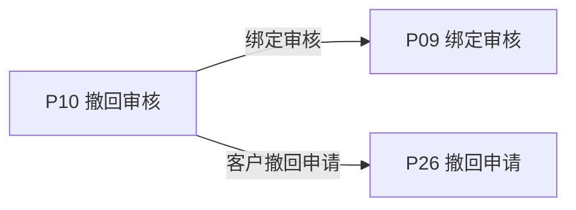
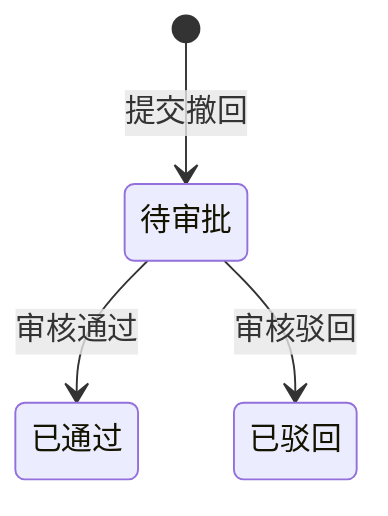

# 《页面功能规格说明书》

> 页面名称：撤回审核  
> 页面编号：P10  
> 文档类型：页面级功能规格

## 01 页面基本信息

| 项目 | 内容 |
| --- | --- |
| 页面名称 | 撤回审核 |
| 页面编号 | P10 |
| 所属模块 | 运营端 / 撤回审核 |
| 使用角色 | 启用状态的运营人员 |
| 页面入口 | `/prototype-multipage/pages/ops/withdrawals.html`；从运营端主导航进入“撤回审核”。 |

## 02 页面业务说明

### 页面目标

审核客户针对已激活产品码段发起的撤回申请，并在通过时准确重置指定激活关系。

### 业务场景

已激活产品可能因业务原因撤回指定码段，系统必须保留原审核历史并准确重置激活关系。

- 按申请编号、产品、客户、状态和日期筛选
- 展开查看多条撤回码段
- 审核通过
- 填写驳回原因后驳回

### 业务对象

| 业务对象 | 页面内职责 | 数据来源与落地要求 |
| --- | --- | --- |
| 撤回申请 | 页面初始化、关联查询或状态计算 | 当前原型为 localStorage / 页面上下文；正式接口待后端契约确认 |
| 激活记录 | 页面初始化、关联查询或状态计算 | 当前原型为 localStorage / 页面上下文；正式接口待后端契约确认 |
| 产品 | 页面初始化、关联查询或状态计算 | 当前原型为 localStorage / 页面上下文；正式接口待后端契约确认 |
| 站内信 | 页面初始化、关联查询或状态计算 | 当前原型为 localStorage / 页面上下文；正式接口待后端契约确认 |

### 业务关系

## 03 页面功能

### 查询

- 按申请编号、产品、客户、状态和日期筛选

### 查看

- 展开查看多条撤回码段
- 查看已处理结果

### 其他操作

- 审核通过
- 填写驳回原因后驳回

## 04 数据定义

| 字段 | 类型 | 必填 | 唯一性 | 默认值 | 可修改性 | 数据来源 |
| --- | --- | --- | --- | --- | --- | --- |
| 申请编号 | 字符串 | 是 | 全局唯一 | — | 否（系统维护） | 撤回申请 |
| 产品名称 | 字符串 | 是 | 否 | — | 否（系统维护） | 产品 |
| 产品批次 | 字符串 | 是 | 业务范围内唯一 | — | 否（系统维护） | 产品 |
| 撤回码段 | 字符串 | 是 | 业务范围内唯一 | — | 否（系统维护） | 撤回申请 |
| 撤回数量 | 整数 | 是 | 否 | 0 | 否（系统维护） | 撤回申请 |
| 客户名称 | 字符串 | 是 | 否 | — | 否（系统维护） | 产品 |
| 撤回原因 | 多行文本 | 是 | 否 | — | 否（系统维护） | 撤回申请 |
| 申请时间 | 日期时间 | 是 | 否 | — | 否（系统维护） | 撤回申请 |
| 状态 | 枚举 | 是 | 否 | 按业务初始状态 | 否（系统维护） | 撤回申请 |
| 处理说明 | 多行文本 | 否 | 否 | — | 否（系统维护） | 撤回申请 |

> “必填”表示业务记录或提交动作必须具备该字段；“可修改性”由后端根据当前业务状态最终校验。

## 05 业务规则

### 数据校验规则

- 通过时只重置申请中精确匹配的有效激活范围
- 重复处理必须被拒绝

### 操作规则

- 未选择其他排序条件时，列表默认按申请时间倒序排列，最新记录在前；用户主动选择排序后按所选规则执行。
- 按申请编号、产品、客户、状态和日期筛选
- 展开查看多条撤回码段
- 查看已处理结果
- 审核通过
- 填写驳回原因后驳回
- 撤回数量不显示单位“枚”
- 驳回不改变原激活关系
- 处理结果通知对应客户
- 待审批可处理
- 已通过显示实际重置结果
- 已驳回显示驳回原因

### 数据一致性规则

- 撤回码段和数量可核对
- 通过后当前绑定状态和订单已激活量同步变化
- 驳回后产品仍保持原激活状态
- 页面数据以后端当前有效业务关系为准，关联页面使用同一数据口径。

## 06 状态管理

### 状态定义

| 状态 | 定义 |
| --- | --- |
| 待审批 | 撤回申请等待运营处理 |
| 已通过 | 指定激活码段已重置 |
| 已驳回 | 原激活关系保持不变 |

### 状态转换图

### 转换条件

| 当前状态 | 目标状态 | 转换条件 |
| --- | --- | --- |
| 初始 | 待审批 | 提交撤回 |
| 待审批 | 已通过 | 审核通过 |
| 待审批 | 已驳回 | 审核驳回 |

### 禁止转换

- 状态转换图中未定义的转换一律禁止。
- 前端不得直接指定目标状态，后端必须根据当前状态和业务条件执行转换。
- 后续业务过程不得覆盖历史审核或操作状态。

## 07 权限管理

### 页面权限

- 仅启用状态的运营人员可访问。

### 操作权限

- 操作权限按当前账号状态、数据权限和业务前置条件判断；本页涉及：按申请编号、产品、客户、状态和日期筛选、展开查看多条撤回码段、查看已处理结果、审核通过、填写驳回原因后驳回。

### 数据权限

- 运营端可访问平台业务数据；涉及账号管理、审核和撤销的操作必须记录操作人及时间。

## 08 系统交互

### 内部系统交互

| 交互对象 | 交互内容 | 调用时机 | 成功处理 | 失败处理 |
| --- | --- | --- | --- | --- |
| 撤回申请 | 页面初始化、关联查询或状态计算 | 页面初始化或关联数据变更后 | 返回最新数据并刷新相关区域 | 保留当前上下文并允许重试 |
| 激活记录 | 页面初始化、关联查询或状态计算 | 页面初始化或关联数据变更后 | 返回最新数据并刷新相关区域 | 保留当前上下文并允许重试 |
| 产品 | 页面初始化、关联查询或状态计算 | 页面初始化或关联数据变更后 | 返回最新数据并刷新相关区域 | 保留当前上下文并允许重试 |
| 站内信 | 页面初始化、关联查询或状态计算 | 页面初始化或关联数据变更后 | 返回最新数据并刷新相关区域 | 保留当前上下文并允许重试 |
| 查询服务 | 按申请编号、产品、客户、状态和日期筛选。查询参数、分页、排序和筛选条件应由正式接口统一接收。 | 查询、筛选、排序或分页时 | 返回匹配数据和总数 | 保留查询条件并允许重试 |
| 审核通过 | 提交当前业务对象标识、操作字段、操作人和客户端请求标识；后端重新校验业务前置条件。 | 用户确认提交时 | 返回最新状态并刷新关联数据 | 不写入成功状态，返回明确原因 |
| 填写驳回原因后驳回 | 提交当前业务对象标识、操作字段、操作人和客户端请求标识；后端重新校验业务前置条件。 | 用户确认提交时 | 返回最新状态并刷新关联数据 | 不写入成功状态，返回明确原因 |

> 当前原型使用浏览器 localStorage 模拟数据存取；正式接口路径、请求方法、错误码和超时阈值由前后端联调时确认。

## 09 异常与边界

### 重复操作

- 写操作必须携带客户端请求标识并保证幂等；重复提交不得重复创建记录、扣减数量或发送通知。

### 并发处理

- 后端在提交时重新校验记录版本、当前状态及数量；发生冲突时拒绝本次操作并返回最新数据。

### 超时处理

- 请求超时时保留当前查询或表单上下文，不得预先写入成功状态；重试时沿用原幂等标识。

### 数据异常

- 查询成功但无记录时展示明确空状态，保留可用的新增、返回或重试入口。
- 未登录、账号禁用、越权访问或数据不属于当前主体时终止操作，并返回无权限或安全的空结果。

## 10 前端交互补充

### 页面结构

| 页面区域 | 内容与职责 |
| --- | --- |
| 页面标题区 | 页面名称及主要新增、导出操作 |
| 查询筛选区 | 搜索、枚举筛选、日期筛选和重置 |
| 数据列表区 | 业务记录、状态和行操作 |
| 分页区 | 总数、页码和每页条数 |
| 弹窗区 | 新增、编辑、审核或确认操作 |

### 页面元素

| 元素 | 说明 |
| --- | --- |
| 申请编号 | 展示或维护申请编号 |
| 产品名称 | 展示或维护产品名称 |
| 产品批次 | 展示或维护产品批次 |
| 撤回码段 | 展示或维护撤回码段 |
| 撤回数量 | 展示或维护撤回数量 |
| 客户名称 | 展示或维护客户名称 |
| 撤回原因 | 展示或维护撤回原因 |
| 申请时间 | 展示或维护申请时间 |
| 状态 | 展示或维护状态 |
| 处理说明 | 展示或维护处理说明 |

### 按钮与弹窗

| 类型 | 操作 | 前端要求 |
| --- | --- | --- |
| 查询 | 按申请编号、产品、客户、状态和日期筛选 | 按业务状态与操作权限决定显示和可用性 |
| 查看 | 展开查看多条撤回码段 | 按业务状态与操作权限决定显示和可用性 |
| 查看 | 查看已处理结果 | 按业务状态与操作权限决定显示和可用性 |
| 其他操作 | 审核通过 | 按业务状态与操作权限决定显示和可用性 |
| 其他操作 | 填写驳回原因后驳回 | 按业务状态与操作权限决定显示和可用性 |

### 交互反馈

- 列表首次加载、重置筛选或清除自定义排序后，恢复默认的时间倒序。
- 多码段默认展示有限条目和汇总，可展开全部
- 页面在桌面和窄屏下无内容重叠，长列表支持分页，宽表支持横向滚动。
- 页面区域、字段名称、状态、权限和数据口径与关联页面保持一致。
- 加载中、成功、失败和空数据状态必须给出明确反馈。
