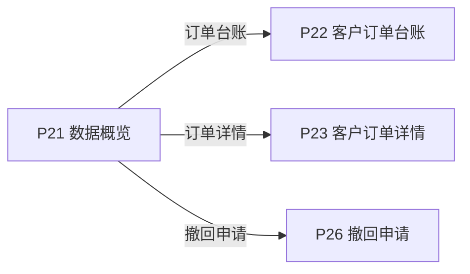
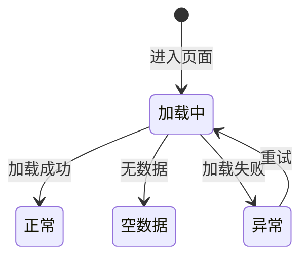

# 《页面功能规格说明书》

> 页面名称：数据概览  
> 页面编号：P21  
> 文档类型：页面级功能规格

## 01 页面基本信息

| 项目 | 内容 |
| --- | --- |
| 页面名称 | 数据概览 |
| 页面编号 | P21 |
| 所属模块 | 客户端 / 工作台 |
| 使用角色 | 当前登录客户账号 |
| 页面入口 | `/prototype-multipage/pages/customer/overview.html`；客户登录后默认进入，或从客户端主导航进入“数据概览”。 |

## 02 页面业务说明

### 页面目标

让客户快速了解本企业订单和码量使用情况，并查看最近申请动态。

### 业务场景

客户需要快速掌握本企业订单与码量使用情况，并从最近业务动态进入实际记录。

- 点击指标进入对应订单范围
- 查看最近申请动态
- 从动态进入对应订单或申请

### 业务对象

| 业务对象 | 页面内职责 | 数据来源与落地要求 |
| --- | --- | --- |
| 当前客户会话 | 页面初始化、关联查询或状态计算 | 当前原型为 localStorage / 页面上下文；正式接口待后端契约确认 |
| 分配订单 | 页面初始化、关联查询或状态计算 | 当前原型为 localStorage / 页面上下文；正式接口待后端契约确认 |
| 绑定申请 | 页面初始化、关联查询或状态计算 | 当前原型为 localStorage / 页面上下文；正式接口待后端契约确认 |
| 激活记录 | 页面初始化、关联查询或状态计算 | 当前原型为 localStorage / 页面上下文；正式接口待后端契约确认 |

### 业务关系

## 03 页面功能

### 查看

- 点击指标进入对应订单范围
- 查看最近申请动态
- 从动态进入对应订单或申请

## 04 数据定义

| 字段 | 类型 | 必填 | 唯一性 | 默认值 | 可修改性 | 数据来源 |
| --- | --- | --- | --- | --- | --- | --- |
| 订单数量 | 整数 | 是 | 否 | 0 | 否（系统维护） | 分配订单 |
| 订单码量 | 整数 | 是 | 否 | 0 | 否（系统维护） | 分配订单 |
| 已激活 | 整数 | 是 | 否 | 0 | 否（系统维护） | 激活记录 |
| 绑定申请中 | 整数 | 是 | 否 | 0 | 否（系统维护） | 绑定申请 |
| 剩余可用 | 整数 | 是 | 否 | 0 | 否（系统维护） | 分配订单 |
| 最近申请动态 | 字符串 | 否 | 否 | — | 否（系统维护） | 绑定申请 |
| 动态发生时间 | 日期时间 | 是 | 否 | — | 否（系统维护） | 绑定申请 / 撤回申请 |

> “必填”表示业务记录或提交动作必须具备该字段；“可修改性”由后端根据当前业务状态最终校验。

## 05 业务规则

### 数据校验规则

- 目标记录不存在时提示并留在当前页
- 点击指标进入对应订单范围

### 计算规则

- 所有数据仅统计当前客户
- 码量口径与订单台账一致

### 操作规则

- 最近订单按分配时间倒序，最近申请动态按对应申请时间倒序，均优先展示最新记录。
- 查看最近申请动态
- 从动态进入对应订单或申请
- 最近申请动态最多展示 5 条
- 无订单时指标显示 0
- 无申请时显示空状态

### 数据一致性规则

- 摘要数字可由订单明细核对
- 最近动态不超过 5 条且不显示时间
- 每条可跳转动态都定位到实际存在的数据
- 页面数据以后端当前有效业务关系为准，关联页面使用同一数据口径。

## 06 状态管理

### 状态定义

| 状态 | 定义 |
| --- | --- |
| 加载中 | 正在读取页面初始化数据 |
| 正常 | 页面数据加载完成 |
| 空数据 | 查询成功但没有业务记录 |
| 异常 | 数据读取或渲染失败 |

### 状态转换图

### 转换条件

| 当前状态 | 目标状态 | 转换条件 |
| --- | --- | --- |
| 初始 | 加载中 | 进入页面 |
| 加载中 | 正常 | 加载成功 |
| 加载中 | 空数据 | 无数据 |
| 加载中 | 异常 | 加载失败 |
| 异常 | 加载中 | 重试 |

### 禁止转换

- 状态转换图中未定义的转换一律禁止。
- 前端不得直接指定目标状态，后端必须根据当前状态和业务条件执行转换。
- 后续业务过程不得覆盖历史审核或操作状态。

## 07 权限管理

### 页面权限

- 仅当前登录客户账号可访问。

### 操作权限

- 操作权限按当前账号状态、数据权限和业务前置条件判断；本页涉及：点击指标进入对应订单范围、查看最近申请动态、从动态进入对应订单或申请。

### 数据权限

- 仅允许访问当前 customer_id 名下的数据；前端筛选不能替代后端数据权限校验。

## 08 系统交互

### 内部系统交互

| 交互对象 | 交互内容 | 调用时机 | 成功处理 | 失败处理 |
| --- | --- | --- | --- | --- |
| 当前客户会话 | 页面初始化、关联查询或状态计算 | 页面初始化或关联数据变更后 | 返回最新数据并刷新相关区域 | 保留当前上下文并允许重试 |
| 分配订单 | 页面初始化、关联查询或状态计算 | 页面初始化或关联数据变更后 | 返回最新数据并刷新相关区域 | 保留当前上下文并允许重试 |
| 绑定申请 | 页面初始化、关联查询或状态计算 | 页面初始化或关联数据变更后 | 返回最新数据并刷新相关区域 | 保留当前上下文并允许重试 |
| 激活记录 | 页面初始化、关联查询或状态计算 | 页面初始化或关联数据变更后 | 返回最新数据并刷新相关区域 | 保留当前上下文并允许重试 |
| 查询服务 | 按页面入口参数读取当前业务对象。查询参数、分页、排序和筛选条件应由正式接口统一接收。 | 查询、筛选、排序或分页时 | 返回匹配数据和总数 | 保留查询条件并允许重试 |

> 当前原型使用浏览器 localStorage 模拟数据存取；正式接口路径、请求方法、错误码和超时阈值由前后端联调时确认。

## 09 异常与边界

### 重复操作

- 写操作必须携带客户端请求标识并保证幂等；重复提交不得重复创建记录、扣减数量或发送通知。

### 并发处理

- 后端在提交时重新校验记录版本、当前状态及数量；发生冲突时拒绝本次操作并返回最新数据。

### 超时处理

- 请求超时时保留当前查询或表单上下文，不得预先写入成功状态；重试时沿用原幂等标识。

### 数据异常

- 查询成功但无记录时展示明确空状态，保留可用的新增、返回或重试入口。
- 未登录、账号禁用、越权访问或数据不属于当前主体时终止操作，并返回无权限或安全的空结果。
- 目标记录不存在时提示并留在当前页

## 10 前端交互补充

### 页面结构

| 页面区域 | 内容与职责 |
| --- | --- |
| 页面标题区 | 页面名称 |
| 指标区 | 订单和码量摘要 |
| 最近订单区 | 最近有效订单 |
| 最近动态区 | 最近申请动态及跳转 |

### 页面元素

| 元素 | 说明 |
| --- | --- |
| 订单数量 | 展示或维护订单数量 |
| 订单码量 | 展示或维护订单码量 |
| 已激活 | 展示或维护已激活 |
| 绑定申请中 | 展示或维护绑定申请中 |
| 剩余可用 | 展示或维护剩余可用 |
| 最近申请动态 | 展示或维护最近申请动态 |

### 按钮与弹窗

| 类型 | 操作 | 前端要求 |
| --- | --- | --- |
| 查看 | 点击指标进入对应订单范围 | 按业务状态与操作权限决定显示和可用性 |
| 查看 | 查看最近申请动态 | 按业务状态与操作权限决定显示和可用性 |
| 查看 | 从动态进入对应订单或申请 | 按业务状态与操作权限决定显示和可用性 |

### 交互反馈

- 最近订单和最近申请动态均以最新记录在前展示。
- 动态展示订单号和数量，不展示时间
- 页面在桌面和窄屏下无内容重叠，长列表支持分页，宽表支持横向滚动。
- 页面区域、字段名称、状态、权限和数据口径与关联页面保持一致。
- 加载中、成功、失败和空数据状态必须给出明确反馈。
