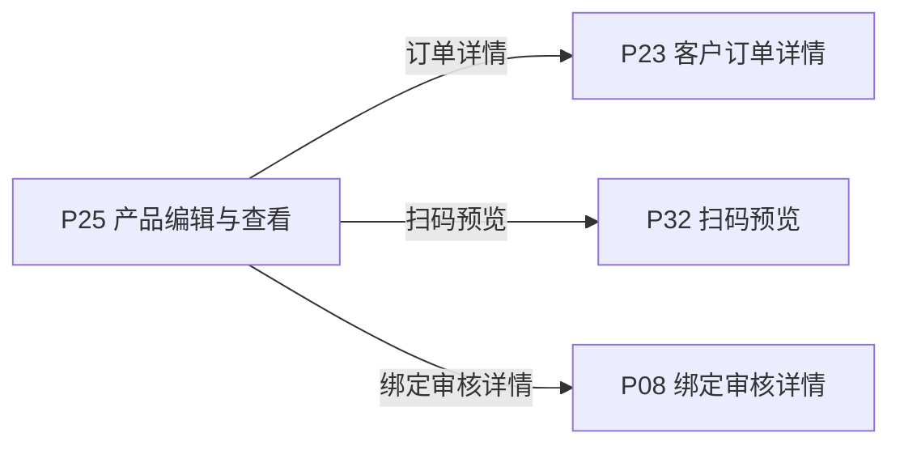
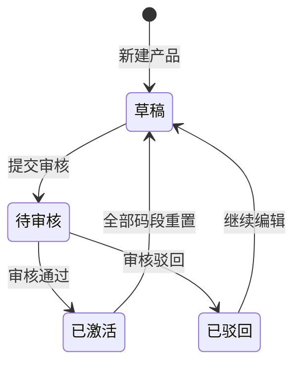

# 《页面功能规格说明书》

> 页面名称：产品编辑与查看  
> 页面编号：P25  
> 文档类型：页面级功能规格

## 01 页面基本信息

| 项目 | 内容 |
| --- | --- |
| 页面名称 | 产品编辑与查看 |
| 页面编号 | P25 |
| 所属模块 | 客户端 / 产品管理 |
| 使用角色 | 产品所属的当前登录客户账号 |
| 页面入口 | `/prototype-multipage/pages/customer/editor.html`；从订单绑定流程、订单绑定记录或申请动态进入，按模式携带产品和订单标识。 |

## 02 页面业务说明

### 页面目标

维护产品公开资料、预览扫码效果，并结合订单提交新建产品或绑定申请。

### 业务场景

产品资料由多个公开模块、标准字段、自定义字段及附件组成，并与订单码段绑定流程关联。

- 维护五类标准字段
- 新增自定义字段
- 上传图片和附件
- 保存草稿

### 业务对象

| 业务对象 | 页面内职责 | 数据来源与落地要求 |
| --- | --- | --- |
| 当前客户会话 | 页面初始化、关联查询或状态计算 | 当前原型为 localStorage / 页面上下文；正式接口待后端契约确认 |
| 产品 | 页面初始化、关联查询或状态计算 | 当前原型为 localStorage / 页面上下文；正式接口待后端契约确认 |
| 分配订单 | 页面初始化、关联查询或状态计算 | 当前原型为 localStorage / 页面上下文；正式接口待后端契约确认 |
| 绑定申请 | 页面初始化、关联查询或状态计算 | 当前原型为 localStorage / 页面上下文；正式接口待后端契约确认 |

### 业务关系

## 03 页面功能

### 新增

- 新增自定义字段
- 生成预览码

### 编辑

- 维护五类标准字段
- 上传图片和附件

### 查看

- 只读查看已提交资料

### 其他操作

- 保存草稿
- 核对信息并提交审核

## 04 数据定义

| 字段 | 类型 | 必填 | 唯一性 | 默认值 | 可修改性 | 数据来源 |
| --- | --- | --- | --- | --- | --- | --- |
| 产品信息 | 字符串 | 是 | 否 | — | 是（草稿或驳回状态） | 产品 |
| 企业信息 | 字符串 | 是 | 否 | — | 是（草稿或驳回状态） | 当前客户会话 |
| 生产单位信息 | 字符串 | 是 | 否 | — | 是（草稿或驳回状态） | 产品 |
| 质量信息 | 字符串 | 是 | 否 | — | 是（草稿或驳回状态） | 产品 |
| 生产追溯信息 | 字符串 | 是 | 否 | — | 是（草稿或驳回状态） | 产品 |
| 绑定订单 | 字符串 | 是 | 否 | — | 是（草稿或驳回状态） | 分配订单 |
| 申请数量 | 整数 | 是 | 否 | 0 | 是（草稿或驳回状态） | 绑定申请 |
| 申请码段 | 字符串 | 是 | 业务范围内唯一 | — | 是（草稿或驳回状态） | 绑定申请 |

> “必填”表示业务记录或提交动作必须具备该字段；“可修改性”由后端根据当前业务状态最终校验。

## 05 业务规则

### 数据校验规则

- 产品图片支持长图，不限制像素宽高和宽高比；单个图片文件不超过 10 MB，并继续校验文件类型和文件数量。
- 有内容的自定义字段必须填写字段名称

### 操作规则

- 新增自定义字段
- 生成预览码
- 维护五类标准字段
- 上传图片和附件
- 只读查看已提交资料
- 保存草稿
- 核对信息并提交审核
- 产品名称和产品批次为最低保存条件
- 标准单文件字段最多 1 个文件，其他媒体字段最多 10 个
- 预览码不占订单码量且不计扫码次数
- 提交前固化订单、数量和连续申请码段
- 草稿和已驳回可编辑
- 待审核只读
- 已激活可查看并从业务入口继续追加绑定
- 上传失败应显示具体文件错误

### 数据一致性规则

- 预览内容与当前编辑资料一致
- 提交确认字段完整且与撤回确认字段风格一致
- 无完整数据的产品不会出现在可点击列表中
- 页面数据以后端当前有效业务关系为准，关联页面使用同一数据口径。

## 06 状态管理

### 状态定义

| 状态 | 定义 |
| --- | --- |
| 草稿 | 产品资料可编辑 |
| 待审核 | 已提交审核并只读 |
| 已激活 | 审核通过且存在有效激活码段 |
| 已驳回 | 可修改后重新提交 |

### 状态转换图

### 转换条件

| 当前状态 | 目标状态 | 转换条件 |
| --- | --- | --- |
| 初始 | 草稿 | 新建产品 |
| 草稿 | 待审核 | 提交审核 |
| 待审核 | 已激活 | 审核通过 |
| 待审核 | 已驳回 | 审核驳回 |
| 已驳回 | 草稿 | 继续编辑 |
| 已激活 | 草稿 | 全部码段重置 |

### 禁止转换

- 状态转换图中未定义的转换一律禁止。
- 前端不得直接指定目标状态，后端必须根据当前状态和业务条件执行转换。
- 后续业务过程不得覆盖历史审核或操作状态。

## 07 权限管理

### 页面权限

- 仅产品所属的当前登录客户账号可访问。

### 操作权限

- 操作权限按当前账号状态、数据权限和业务前置条件判断；本页涉及：新增自定义字段、生成预览码、维护五类标准字段、上传图片和附件、只读查看已提交资料、保存草稿、核对信息并提交审核。

### 数据权限

- 仅允许访问当前 customer_id 名下的数据；前端筛选不能替代后端数据权限校验。

## 08 系统交互

### 内部系统交互

| 交互对象 | 交互内容 | 调用时机 | 成功处理 | 失败处理 |
| --- | --- | --- | --- | --- |
| 当前客户会话 | 页面初始化、关联查询或状态计算 | 页面初始化或关联数据变更后 | 返回最新数据并刷新相关区域 | 保留当前上下文并允许重试 |
| 产品 | 页面初始化、关联查询或状态计算 | 页面初始化或关联数据变更后 | 返回最新数据并刷新相关区域 | 保留当前上下文并允许重试 |
| 分配订单 | 页面初始化、关联查询或状态计算 | 页面初始化或关联数据变更后 | 返回最新数据并刷新相关区域 | 保留当前上下文并允许重试 |
| 绑定申请 | 页面初始化、关联查询或状态计算 | 页面初始化或关联数据变更后 | 返回最新数据并刷新相关区域 | 保留当前上下文并允许重试 |
| 查询服务 | 按页面入口参数读取当前业务对象。查询参数、分页、排序和筛选条件应由正式接口统一接收。 | 查询、筛选、排序或分页时 | 返回匹配数据和总数 | 保留查询条件并允许重试 |
| 新增自定义字段 | 提交当前业务对象标识、操作字段、操作人和客户端请求标识；后端重新校验业务前置条件。 | 用户确认提交时 | 返回最新状态并刷新关联数据 | 不写入成功状态，返回明确原因 |
| 生成预览码 | 提交当前业务对象标识、操作字段、操作人和客户端请求标识；后端重新校验业务前置条件。 | 用户确认提交时 | 返回最新状态并刷新关联数据 | 不写入成功状态，返回明确原因 |
| 维护五类标准字段 | 提交当前业务对象标识、操作字段、操作人和客户端请求标识；后端重新校验业务前置条件。 | 用户确认提交时 | 返回最新状态并刷新关联数据 | 不写入成功状态，返回明确原因 |
| 上传图片和附件 | 提交当前业务对象标识、操作字段、操作人和客户端请求标识；后端重新校验业务前置条件。 | 用户确认提交时 | 返回最新状态并刷新关联数据 | 不写入成功状态，返回明确原因 |
| 保存草稿 | 提交当前业务对象标识、操作字段、操作人和客户端请求标识；后端重新校验业务前置条件。 | 用户确认提交时 | 返回最新状态并刷新关联数据 | 不写入成功状态，返回明确原因 |
| 核对信息并提交审核 | 提交当前业务对象标识、操作字段、操作人和客户端请求标识；后端重新校验业务前置条件。 | 用户确认提交时 | 返回最新状态并刷新关联数据 | 不写入成功状态，返回明确原因 |

### 第三方系统交互

| 第三方对象 | 交互内容 | 调用时机 | 成功处理 | 失败处理 |
| --- | --- | --- | --- | --- |
| 对象存储 / 公共扫码服务 | 文件或图片资源由对象存储提供；扫码页面按公开 URL 读取。 | 读取资源或执行异步任务时 | 返回可访问资源或任务结果 | 记录失败原因并支持安全重试 |

> 当前原型使用浏览器 localStorage 模拟数据存取；正式接口路径、请求方法、错误码和超时阈值由前后端联调时确认。

## 09 异常与边界

### 重复操作

- 写操作必须携带客户端请求标识并保证幂等；重复提交不得重复创建记录、扣减数量或发送通知。

### 并发处理

- 后端在提交时重新校验记录版本、当前状态及数量；发生冲突时拒绝本次操作并返回最新数据。

### 超时处理

- 请求超时时保留当前查询或表单上下文，不得预先写入成功状态；重试时沿用原幂等标识。

### 第三方异常

- 第三方资源或异步任务失败时，保留本地业务记录和失败原因，不得标记为已完成，并支持安全重试。

### 数据异常

- 图片文件超过大小上限或类型不支持时拒绝上传；不得因像素尺寸、宽高比或长图形式拒绝。
- 查询成功但无记录时展示明确空状态，保留可用的新增、返回或重试入口。
- 未登录、账号禁用、越权访问或数据不属于当前主体时终止操作，并返回无权限或安全的空结果。
- 上传失败应显示具体文件错误

## 10 前端交互补充

### 页面结构

| 页面区域 | 内容与职责 |
| --- | --- |
| 页面标题区 | 页面名称、返回或步骤状态 |
| 表单区 | 业务字段、校验和附件 |
| 预览区 | 二维码或产品效果预览 |
| 操作区 | 保存、提交、下载或返回 |

### 页面元素

| 元素 | 说明 |
| --- | --- |
| 产品信息 | 展示或维护产品信息 |
| 企业信息 | 展示或维护企业信息 |
| 生产单位信息 | 展示或维护生产单位信息 |
| 质量信息 | 展示或维护质量信息 |
| 生产追溯信息 | 展示或维护生产追溯信息 |
| 绑定订单 | 展示或维护绑定订单 |
| 申请数量 | 展示或维护申请数量 |
| 申请码段 | 展示或维护申请码段 |

### 按钮与弹窗

| 类型 | 操作 | 前端要求 |
| --- | --- | --- |
| 新增 | 新增自定义字段 | 按业务状态与操作权限决定显示和可用性 |
| 新增 | 生成预览码 | 按业务状态与操作权限决定显示和可用性 |
| 编辑 | 维护五类标准字段 | 按业务状态与操作权限决定显示和可用性 |
| 编辑 | 上传图片和附件 | 按业务状态与操作权限决定显示和可用性 |
| 查看 | 只读查看已提交资料 | 按业务状态与操作权限决定显示和可用性 |
| 其他操作 | 保存草稿 | 按业务状态与操作权限决定显示和可用性 |
| 其他操作 | 核对信息并提交审核 | 按业务状态与操作权限决定显示和可用性 |

### 交互反馈

- 图片结束后立即衔接下一项内容，不使用固定容器高度，不在图片下方保留多余留白。
- 产品图片按原始宽高比完整展示，长图容器高度随图片内容自适应，不裁剪、不拉伸。
- 页面在桌面和窄屏下无内容重叠，长列表支持分页，宽表支持横向滚动。
- 页面区域、字段名称、状态、权限和数据口径与关联页面保持一致。
- 加载中、成功、失败和空数据状态必须给出明确反馈。
