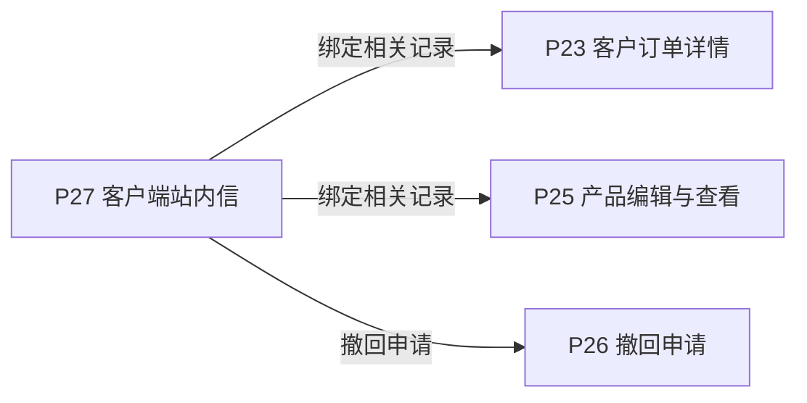
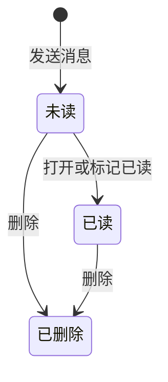

# 《页面功能规格说明书》

> 页面名称：客户端站内信  
> 页面编号：P27  
> 文档类型：页面级功能规格

## 01 页面基本信息

| 项目 | 内容 |
| --- | --- |
| 页面名称 | 客户端站内信 |
| 页面编号 | P27 |
| 所属模块 | 客户端 / 站内信 |
| 使用角色 | 当前登录客户账号 |
| 页面入口 | `/prototype-multipage/pages/customer/messages.html`；从客户端主导航进入“站内信”。 |

## 02 页面业务说明

### 页面目标

接收并查看与本人产品绑定和撤回审核相关的结果通知。

### 业务场景

系统通过站内信传递绑定和撤回审核结果，消息范围必须与当前登录主体严格隔离。

- 按标题、内容、类型、阅读状态和日期筛选
- 打开消息详情
- 批量标记已读
- 批量删除

### 业务对象

| 业务对象 | 页面内职责 | 数据来源与落地要求 |
| --- | --- | --- |
| 当前客户会话 | 页面初始化、关联查询或状态计算 | 当前原型为 localStorage / 页面上下文；正式接口待后端契约确认 |
| 站内信 | 页面初始化、关联查询或状态计算 | 当前原型为 localStorage / 页面上下文；正式接口待后端契约确认 |

### 业务关系

## 03 页面功能

### 查询

- 按标题、内容、类型、阅读状态和日期筛选

### 删除

- 批量删除

### 查看

- 打开消息详情

### 其他操作

- 批量标记已读

## 04 数据定义

| 字段 | 类型 | 必填 | 唯一性 | 默认值 | 可修改性 | 数据来源 |
| --- | --- | --- | --- | --- | --- | --- |
| 阅读状态 | 枚举 | 是 | 否 | 按业务初始状态 | 否（系统维护） | 站内信 |
| 标题 | 字符串 | 是 | 否 | — | 否（系统维护） | 站内信 |
| 内容摘要 | 多行文本 | 是 | 否 | — | 否（系统维护） | 站内信 |
| 接收时间 | 日期时间 | 是 | 否 | — | 否（系统维护） | 当前客户会话 |
| 消息类型 | 枚举 | 是 | 否 | — | 否（系统维护） | 站内信 |

> “必填”表示业务记录或提交动作必须具备该字段；“可修改性”由后端根据当前业务状态最终校验。

## 05 业务规则

### 操作规则

- 未选择其他排序条件时，列表默认按接收时间倒序排列，最新记录在前；用户主动选择排序后按所选规则执行。
- 按标题、内容、类型、阅读状态和日期筛选
- 批量删除
- 打开消息详情
- 批量标记已读
- 只展示当前客户的业务结果消息
- 分配码段不产生站内信
- 申请提交类内部动态不作为站内信
- 删除消息不影响业务记录
- 未读、已读
- 无消息时显示空状态
- 批量操作未选择记录时不可执行

### 数据一致性规则

- 不会看到其他客户消息
- 打开未读消息后更新阅读状态
- 通知内容可对应到真实业务记录
- 页面数据以后端当前有效业务关系为准，关联页面使用同一数据口径。

## 06 状态管理

### 状态定义

| 状态 | 定义 |
| --- | --- |
| 未读 | 接收方尚未打开 |
| 已读 | 接收方已查看 |
| 已删除 | 消息不再在列表展示 |

### 状态转换图

### 转换条件

| 当前状态 | 目标状态 | 转换条件 |
| --- | --- | --- |
| 初始 | 未读 | 发送消息 |
| 未读 | 已读 | 打开或标记已读 |
| 未读 | 已删除 | 删除 |
| 已读 | 已删除 | 删除 |

### 禁止转换

- 状态转换图中未定义的转换一律禁止。
- 前端不得直接指定目标状态，后端必须根据当前状态和业务条件执行转换。
- 后续业务过程不得覆盖历史审核或操作状态。

## 07 权限管理

### 页面权限

- 仅当前登录客户账号可访问。

### 操作权限

- 操作权限按当前账号状态、数据权限和业务前置条件判断；本页涉及：按标题、内容、类型、阅读状态和日期筛选、批量删除、打开消息详情、批量标记已读。

### 数据权限

- 仅允许访问当前 customer_id 名下的数据；前端筛选不能替代后端数据权限校验。

## 08 系统交互

### 内部系统交互

| 交互对象 | 交互内容 | 调用时机 | 成功处理 | 失败处理 |
| --- | --- | --- | --- | --- |
| 当前客户会话 | 页面初始化、关联查询或状态计算 | 页面初始化或关联数据变更后 | 返回最新数据并刷新相关区域 | 保留当前上下文并允许重试 |
| 站内信 | 页面初始化、关联查询或状态计算 | 页面初始化或关联数据变更后 | 返回最新数据并刷新相关区域 | 保留当前上下文并允许重试 |
| 查询服务 | 按标题、内容、类型、阅读状态和日期筛选。查询参数、分页、排序和筛选条件应由正式接口统一接收。 | 查询、筛选、排序或分页时 | 返回匹配数据和总数 | 保留查询条件并允许重试 |
| 批量删除 | 提交当前业务对象标识、操作字段、操作人和客户端请求标识；后端重新校验业务前置条件。 | 用户确认提交时 | 返回最新状态并刷新关联数据 | 不写入成功状态，返回明确原因 |
| 批量标记已读 | 提交当前业务对象标识、操作字段、操作人和客户端请求标识；后端重新校验业务前置条件。 | 用户确认提交时 | 返回最新状态并刷新关联数据 | 不写入成功状态，返回明确原因 |

> 当前原型使用浏览器 localStorage 模拟数据存取；正式接口路径、请求方法、错误码和超时阈值由前后端联调时确认。

## 09 异常与边界

### 重复操作

- 写操作必须携带客户端请求标识并保证幂等；重复提交不得重复创建记录、扣减数量或发送通知。

### 并发处理

- 后端在提交时重新校验记录版本、当前状态及数量；发生冲突时拒绝本次操作并返回最新数据。

### 超时处理

- 请求超时时保留当前查询或表单上下文，不得预先写入成功状态；重试时沿用原幂等标识。

### 数据异常

- 查询成功但无记录时展示明确空状态，保留可用的新增、返回或重试入口。
- 未登录、账号禁用、越权访问或数据不属于当前主体时终止操作，并返回无权限或安全的空结果。

## 10 前端交互补充

### 页面结构

| 页面区域 | 内容与职责 |
| --- | --- |
| 页面标题区 | 页面名称及主要新增、导出操作 |
| 查询筛选区 | 搜索、枚举筛选、日期筛选和重置 |
| 数据列表区 | 业务记录、状态和行操作 |
| 分页区 | 总数、页码和每页条数 |
| 弹窗区 | 新增、编辑、审核或确认操作 |

### 页面元素

| 元素 | 说明 |
| --- | --- |
| 阅读状态 | 展示或维护阅读状态 |
| 标题 | 展示或维护标题 |
| 内容摘要 | 展示或维护内容摘要 |
| 接收时间 | 展示或维护接收时间 |
| 消息类型 | 展示或维护消息类型 |

### 按钮与弹窗

| 类型 | 操作 | 前端要求 |
| --- | --- | --- |
| 查询 | 按标题、内容、类型、阅读状态和日期筛选 | 按业务状态与操作权限决定显示和可用性 |
| 删除 | 批量删除 | 按业务状态与操作权限决定显示和可用性 |
| 查看 | 打开消息详情 | 按业务状态与操作权限决定显示和可用性 |
| 其他操作 | 批量标记已读 | 按业务状态与操作权限决定显示和可用性 |

### 交互反馈

- 列表首次加载、重置筛选或清除自定义排序后，恢复默认的时间倒序。
- 页面在桌面和窄屏下无内容重叠，长列表支持分页，宽表支持横向滚动。
- 页面区域、字段名称、状态、权限和数据口径与关联页面保持一致。
- 加载中、成功、失败和空数据状态必须给出明确反馈。
