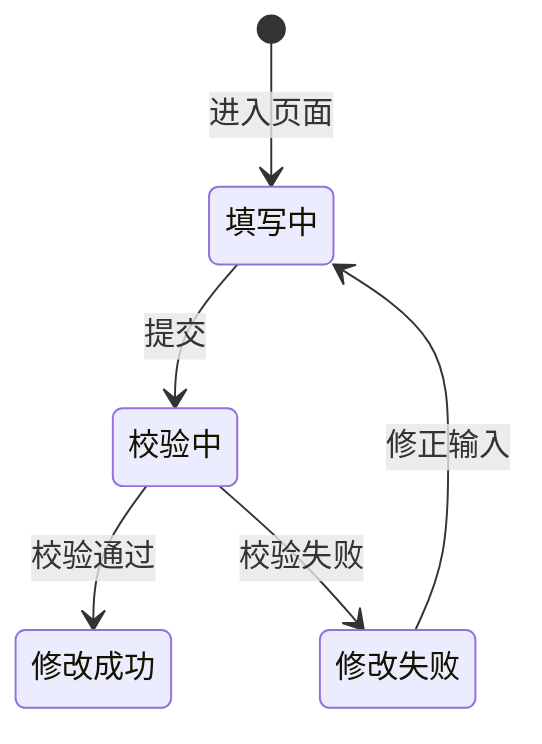

# 《页面功能规格说明书》

> 页面名称：客户端修改登录密码
> 页面编号：P28  
> 文档类型：页面级功能规格

## 01 页面基本信息

| 项目 | 内容 |
| --- | --- |
| 页面名称 | 客户端修改登录密码 |
| 页面编号 | P28 |
| 所属模块 | 客户端 / 个人中心 |
| 使用角色 | 当前登录客户账号 |
| 页面入口 | 点击右上角头像直接弹出“修改登录密码”；`/prototype-multipage/pages/customer/settings.html` 仅作为历史链接兼容入口。 |

## 02 页面业务说明

### 页面目标

通过右上角头像弹窗修改当前客户账号的本人登录密码。

### 业务场景

登录用户只能维护本人账号凭据，密码修改需要同时满足身份校验和安全规则。

- 修改密码
- 退出登录

### 业务对象

| 业务对象 | 页面内职责 | 数据来源与落地要求 |
| --- | --- | --- |
| 当前客户会话 | 页面初始化、关联查询或状态计算 | 当前原型为 localStorage / 页面上下文；正式接口待后端契约确认 |

### 业务关系

## 03 页面功能

### 编辑

- 修改密码

### 其他操作

- 退出登录

## 04 数据定义

| 字段 | 类型 | 必填 | 唯一性 | 默认值 | 可修改性 | 数据来源 |
| --- | --- | --- | --- | --- | --- | --- |
| 客户名称 | 字符串 | 是 | 否 | — | 否（系统维护） | 当前客户会话 |
| 登录账号 | 字符串 | 是 | 全局唯一 | — | 否（系统维护） | 当前客户会话 |
| 账号状态 | 枚举 | 是 | 否 | 按业务初始状态 | 否（系统维护） | 当前客户会话 |
| 当前密码 | 字符串 | 是 | 否 | — | 是（仅修改密码时） | 当前客户会话 |
| 新密码 | 字符串 | 是 | 否 | — | 是（仅修改密码时） | 当前客户会话 |
| 确认新密码 | 字符串 | 是 | 否 | — | 是（仅修改密码时） | 当前客户会话 |

> “必填”表示业务记录或提交动作必须具备该字段；“可修改性”由后端根据当前业务状态最终校验。

## 05 业务规则

### 数据校验规则

- 必须校验当前密码
- 新密码长度为 8～20 位且同时包含字母和数字
- 确认密码必填，两次新密码必须一致
- 只能修改当前账号密码
- 校验错误显示在对应字段

密码输入框下方固定显示“密码长度为8～20位，需包含字母和数字”。空当前密码提示“请输入当前密码”；空新密码提示“请输入密码”；少于 8 位提示“密码长度不能少于8位”；超过 20 位提示“密码长度不能超过20位”；缺少字母或数字提示“密码需包含字母和数字”；空确认密码提示“请再次输入密码”；两次不一致提示“两次输入的密码不一致”。正式修改密码接口必须复验当前密码和全部新密码规则，校验失败不得写入。

### 操作规则

- 修改密码
- 退出登录
- 保存成功后清空密码输入
- 客户账号被禁用时强制退出

### 数据一致性规则

- 旧密码校验失败时不修改
- 新密码生效后旧密码不能登录
- 页面不展示或记录明文密码
- 页面数据以后端当前有效业务关系为准，关联页面使用同一数据口径。

## 06 状态管理

### 状态定义

| 状态 | 定义 |
| --- | --- |
| 填写中 | 输入当前密码和新密码 |
| 校验中 | 校验当前密码及新密码规则 |
| 修改成功 | 新密码已生效 |
| 修改失败 | 校验或保存失败 |

### 状态转换图

### 转换条件

| 当前状态 | 目标状态 | 转换条件 |
| --- | --- | --- |
| 初始 | 填写中 | 进入页面 |
| 填写中 | 校验中 | 提交 |
| 校验中 | 修改成功 | 校验通过 |
| 校验中 | 修改失败 | 校验失败 |
| 修改失败 | 填写中 | 修正输入 |

### 禁止转换

- 状态转换图中未定义的转换一律禁止。
- 前端不得直接指定目标状态，后端必须根据当前状态和业务条件执行转换。
- 后续业务过程不得覆盖历史审核或操作状态。

## 07 权限管理

### 页面权限

- 仅当前登录客户账号可访问。

### 操作权限

- 操作权限按当前账号状态、数据权限和业务前置条件判断；本页涉及：修改密码、退出登录。

### 数据权限

- 仅允许访问当前 customer_id 名下的数据；前端筛选不能替代后端数据权限校验。

## 08 系统交互

### 内部系统交互

| 交互对象 | 交互内容 | 调用时机 | 成功处理 | 失败处理 |
| --- | --- | --- | --- | --- |
| 当前客户会话 | 页面初始化、关联查询或状态计算 | 页面初始化或关联数据变更后 | 返回最新数据并刷新相关区域 | 保留当前上下文并允许重试 |
| 查询服务 | 按页面入口参数读取当前业务对象。查询参数、分页、排序和筛选条件应由正式接口统一接收。 | 查询、筛选、排序或分页时 | 返回匹配数据和总数 | 保留查询条件并允许重试 |
| 修改密码 | 提交当前业务对象标识、操作字段、操作人和客户端请求标识；后端重新校验业务前置条件。 | 用户确认提交时 | 返回最新状态并刷新关联数据 | 不写入成功状态，返回明确原因 |
| 退出登录 | 提交当前业务对象标识、操作字段、操作人和客户端请求标识；后端重新校验业务前置条件。 | 用户确认提交时 | 返回最新状态并刷新关联数据 | 不写入成功状态，返回明确原因 |

> 当前原型使用浏览器 localStorage 模拟数据存取；正式接口路径、请求方法、错误码和超时阈值由前后端联调时确认。

## 09 异常与边界

### 重复操作

- 写操作必须携带客户端请求标识并保证幂等；重复提交不得重复创建记录、扣减数量或发送通知。

### 并发处理

- 后端在提交时重新校验记录版本、当前状态及数量；发生冲突时拒绝本次操作并返回最新数据。

### 超时处理

- 请求超时时保留当前查询或表单上下文，不得预先写入成功状态；重试时沿用原幂等标识。

### 数据异常

- 查询成功但无记录时展示明确空状态，保留可用的新增、返回或重试入口。
- 未登录、账号禁用、越权访问或数据不属于当前主体时终止操作，并返回无权限或安全的空结果。
- 校验错误显示在对应字段

## 10 前端交互补充

### 页面结构

| 页面区域 | 内容与职责 |
| --- | --- |
| 顶栏头像 | 打开修改登录密码弹窗 |
| 弹窗表单区 | 当前密码、新密码、确认新密码 |
| 弹窗操作区 | 取消、保存 |

### 页面元素

| 元素 | 说明 |
| --- | --- |
| 客户名称 | 展示或维护客户名称 |
| 登录账号 | 展示或维护登录账号 |
| 账号状态 | 展示或维护账号状态 |
| 当前密码 | 展示或维护当前密码 |
| 新密码 | 展示或维护新密码 |
| 确认新密码 | 展示或维护确认新密码 |

### 按钮与弹窗

| 类型 | 操作 | 前端要求 |
| --- | --- | --- |
| 编辑 | 修改密码 | 从右上角头像打开弹窗，按业务状态与操作权限决定显示和可用性 |
| 其他操作 | 退出登录 | 按业务状态与操作权限决定显示和可用性 |

### 交互反馈

- 页面在桌面和窄屏下无内容重叠，长列表支持分页，宽表支持横向滚动。
- 页面区域、字段名称、状态、权限和数据口径与关联页面保持一致。
- 加载中、成功、失败和空数据状态必须给出明确反馈。
