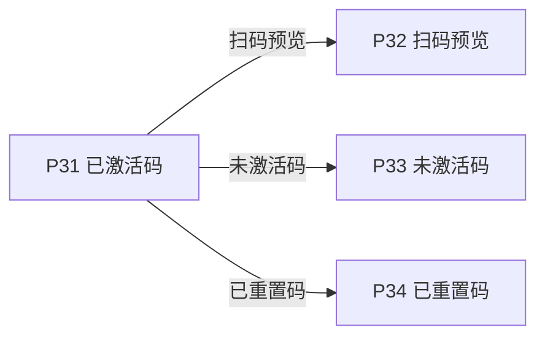
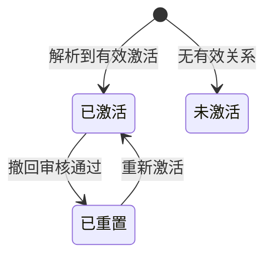

# 《页面功能规格说明书》

> 页面名称：已激活码  
> 页面编号：P31  
> 文档类型：页面级功能规格

## 01 页面基本信息

| 项目 | 内容 |
| --- | --- |
| 页面名称 | 已激活码 |
| 页面编号 | P31 |
| 所属模块 | 扫码端 / 扫码展示 |
| 使用角色 | 无需登录的扫码用户 |
| 页面入口 | `/prototype-multipage/pages/scan/active.html`；扫描或访问携带序列号的二维码地址，系统判定该码存在有效激活关系。 |

## 02 页面业务说明

### 页面目标

展示单个有效激活码对应的公开产品资料和溯源信息。

### 业务场景

消费者通过单个序列号访问公开页面，系统需要根据真实激活与重置关系确定展示状态并控制公开字段。

- 切换资料模块
- 展开超过 5 项的文本字段
- 查看图片和附件
- 通过原型导航切换状态示例

### 业务对象

| 业务对象 | 页面内职责 | 数据来源与落地要求 |
| --- | --- | --- |
| 单码状态 | 页面初始化、关联查询或状态计算 | 当前原型为 localStorage / 页面上下文；正式接口待后端契约确认 |
| 产品 | 页面初始化、关联查询或状态计算 | 当前原型为 localStorage / 页面上下文；正式接口待后端契约确认 |
| 激活记录 | 页面初始化、关联查询或状态计算 | 当前原型为 localStorage / 页面上下文；正式接口待后端契约确认 |
| 撤回申请 | 页面初始化、关联查询或状态计算 | 当前原型为 localStorage / 页面上下文；正式接口待后端契约确认 |
| 扫码记录 | 页面初始化、关联查询或状态计算 | 当前原型为 localStorage / 页面上下文；正式接口待后端契约确认 |

### 业务关系

## 03 页面功能

### 查看

- 切换资料模块
- 展开超过 5 项的文本字段
- 查看图片和附件
- 通过原型导航切换状态示例

## 04 数据定义

| 字段 | 类型 | 必填 | 唯一性 | 默认值 | 可修改性 | 数据来源 |
| --- | --- | --- | --- | --- | --- | --- |
| 固定横幅 | 字符串 | 是 | 否 | — | 否（系统维护） | 单码状态 |
| 产品名称 | 字符串 | 是 | 否 | — | 否（系统维护） | 产品 |
| 序列号 | 字符串 | 是 | 全局唯一 | — | 否（系统维护） | 激活记录 |
| 查询次数 | 整数 | 否 | 否 | 0 | 否（系统维护） | 激活记录 |
| 产品信息 | 字符串 | 是 | 否 | — | 否（系统维护） | 产品 |
| 企业信息 | 字符串 | 是 | 否 | — | 否（系统维护） | 产品 |
| 生产单位信息 | 字符串 | 是 | 否 | — | 否（系统维护） | 产品 |
| 质量信息 | 字符串 | 是 | 否 | — | 否（系统维护） | 产品 |
| 生产追溯信息 | 字符串 | 是 | 否 | — | 否（系统维护） | 产品 |

> “必填”表示业务记录或提交动作必须具备该字段；“可修改性”由后端根据当前业务状态最终校验。

## 05 业务规则

### 数据校验规则

- 状态由后端实际码关系判断，不能由查询参数强制覆盖

### 操作规则

- 切换资料模块
- 展开超过 5 项的文本字段
- 查看图片和附件
- 通过原型导航切换状态示例
- 只展示有内容的公开字段
- 产品大类和子类不公开展示
- 真实已激活单码访问计入扫码次数
- 序列号无效时进入未激活页
- 最近重置晚于激活时进入已重置页

### 数据一致性规则

- 任何有效已激活产品均能打开完整资料
- 序列号和产品关联与后台数据一致
- 页面数据以后端当前有效业务关系为准，关联页面使用同一数据口径。

## 06 状态管理

### 状态定义

| 状态 | 定义 |
| --- | --- |
| 已激活 | 存在晚于最近重置的有效激活记录 |
| 已重置 | 最近有效事件为撤回重置 |
| 未激活 | 不存在有效激活关系 |

### 状态转换图

### 转换条件

| 当前状态 | 目标状态 | 转换条件 |
| --- | --- | --- |
| 初始 | 已激活 | 解析到有效激活 |
| 已激活 | 已重置 | 撤回审核通过 |
| 已重置 | 已激活 | 重新激活 |
| 初始 | 未激活 | 无有效关系 |

### 禁止转换

- 状态转换图中未定义的转换一律禁止。
- 前端不得直接指定目标状态，后端必须根据当前状态和业务条件执行转换。
- 后续业务过程不得覆盖历史审核或操作状态。

## 07 权限管理

### 页面权限

- 无需登录；只能通过单个序列号或受控预览上下文访问公开页面。

### 操作权限

- 操作权限按当前账号状态、数据权限和业务前置条件判断；本页涉及：切换资料模块、展开超过 5 项的文本字段、查看图片和附件、通过原型导航切换状态示例。

### 数据权限

- 只能读取当前单码对应的公开字段，不得返回客户后台字段、内部审核信息或其他码数据。

## 08 系统交互

### 内部系统交互

| 交互对象 | 交互内容 | 调用时机 | 成功处理 | 失败处理 |
| --- | --- | --- | --- | --- |
| 单码状态 | 页面初始化、关联查询或状态计算 | 页面初始化或关联数据变更后 | 返回最新数据并刷新相关区域 | 保留当前上下文并允许重试 |
| 产品 | 页面初始化、关联查询或状态计算 | 页面初始化或关联数据变更后 | 返回最新数据并刷新相关区域 | 保留当前上下文并允许重试 |
| 激活记录 | 页面初始化、关联查询或状态计算 | 页面初始化或关联数据变更后 | 返回最新数据并刷新相关区域 | 保留当前上下文并允许重试 |
| 撤回申请 | 页面初始化、关联查询或状态计算 | 页面初始化或关联数据变更后 | 返回最新数据并刷新相关区域 | 保留当前上下文并允许重试 |
| 扫码记录 | 页面初始化、关联查询或状态计算 | 页面初始化或关联数据变更后 | 返回最新数据并刷新相关区域 | 保留当前上下文并允许重试 |
| 查询服务 | 按页面入口参数读取当前业务对象。查询参数、分页、排序和筛选条件应由正式接口统一接收。 | 查询、筛选、排序或分页时 | 返回匹配数据和总数 | 保留查询条件并允许重试 |

### 第三方系统交互

| 第三方对象 | 交互内容 | 调用时机 | 成功处理 | 失败处理 |
| --- | --- | --- | --- | --- |
| 对象存储 / 公共扫码服务 | 文件或图片资源由对象存储提供；扫码页面按公开 URL 读取。 | 读取资源或执行异步任务时 | 返回可访问资源或任务结果 | 记录失败原因并支持安全重试 |

> 当前原型使用浏览器 localStorage 模拟数据存取；正式接口路径、请求方法、错误码和超时阈值由前后端联调时确认。

## 09 异常与边界

### 重复操作

- 写操作必须携带客户端请求标识并保证幂等；重复提交不得重复创建记录、扣减数量或发送通知。

### 并发处理

- 后端在提交时重新校验记录版本、当前状态及数量；发生冲突时拒绝本次操作并返回最新数据。

### 超时处理

- 请求超时时保留当前查询或表单上下文，不得预先写入成功状态；重试时沿用原幂等标识。

### 第三方异常

- 第三方资源或异步任务失败时，保留本地业务记录和失败原因，不得标记为已完成，并支持安全重试。

### 数据异常

- 查询成功但无记录时展示明确空状态，保留可用的新增、返回或重试入口。
- 未登录、账号禁用、越权访问或数据不属于当前主体时终止操作，并返回无权限或安全的空结果。

## 10 前端交互补充

### 页面结构

| 页面区域 | 内容与职责 |
| --- | --- |
| 状态头部区 | 码状态、固定横幅或状态提示 |
| 主体信息区 | 序列号与公开产品信息 |
| 资料模块区 | 按模块展示公开溯源字段 |
| 原型切换区 | 切换扫码状态示例 |

### 页面元素

| 元素 | 说明 |
| --- | --- |
| 固定横幅 | 展示或维护固定横幅 |
| 产品名称 | 展示或维护产品名称 |
| 序列号 | 展示或维护序列号 |
| 查询次数 | 展示或维护查询次数 |
| 产品信息 | 展示或维护产品信息 |
| 企业信息 | 展示或维护企业信息 |
| 生产单位信息 | 展示或维护生产单位信息 |
| 质量信息 | 展示或维护质量信息 |
| 生产追溯信息 | 展示或维护生产追溯信息 |

### 按钮与弹窗

| 类型 | 操作 | 前端要求 |
| --- | --- | --- |
| 查看 | 切换资料模块 | 按业务状态与操作权限决定显示和可用性 |
| 查看 | 展开超过 5 项的文本字段 | 按业务状态与操作权限决定显示和可用性 |
| 查看 | 查看图片和附件 | 按业务状态与操作权限决定显示和可用性 |
| 查看 | 通过原型导航切换状态示例 | 按业务状态与操作权限决定显示和可用性 |

### 交互反馈

- 页面上划时冻结小程序标题、产品摘要、查询信息和资料标签；顶部横幅图片不进入冻结区域，随页面正常滚出。
- 图片结束后立即衔接下一项内容，不使用固定容器高度，不在图片下方保留多余留白。
- 产品图片按原始宽高比完整展示，长图容器高度随图片内容自适应，不裁剪、不拉伸。
- 顶部只展示统一固定横幅，不使用产品首图替代
- 页面在桌面和窄屏下无内容重叠，长列表支持分页，宽表支持横向滚动。
- 页面区域、字段名称、状态、权限和数据口径与关联页面保持一致。
- 加载中、成功、失败和空数据状态必须给出明确反馈。
- 产品资料不完整时隐藏空字段而非展示占位
- 固定横幅在不同产品和用户下保持一致
